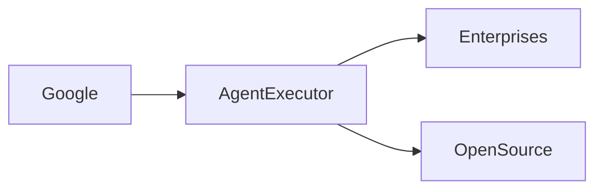

# El Orquestador Agente de Google: Cambios de Poder en la IA Open Source

Google ha lanzado recientemente **AgentExecutor**, una plataforma de orquestación agente basada en código abierto que promete simplificar la coordinación de múltiples inteligencias artificiales en entornos empresariales. La noticia, que ha circulado en foros de desarrolladores y en la prensa especializada, no es solo un avance técnico; es un movimiento estratégico que podría reconfigurar las relaciones de poder dentro de la industria tecnológica.

## ¿Qué es AgentExecutor?

AgentExecutor es, esencialmente, un marco que permite a los desarrolladores encadenar “agentes” de IA — componentes autónomos que pueden percibir, decidir y actuar — a través de una arquitectura declarativa. La herramienta se distribuye bajo una licencia permissiva, lo que la coloca en la misma categoría que otros proyectos emblemáticos como **Kubernetes** o **TensorFlow**. Al ser open source, cualquiera puede inspeccionar, modificar y contribuir al código, lo que suele asociarse con mayor transparencia y menor dependencia de proveedores propietarios.

Sin embargo, la simplicidad de su modelo de licenciamiento oculta una estrategia de captura de mercado más profunda. Al ofrecer una base estándar que facilita la integración con servicios de Google Cloud, la empresa no solo está creando un nuevo punto de entrada para sus propias ofertas de IA, sino también estableciendo un estándar de facto que podría desviar flujos de capital y talento hacia su ecosistema.

## Un vistazo histórico: cómo el software abierto ha moldeado el poder

La historia de la tecnología muestra patrones repetidos: una comunidad de código abierto genera una plataforma atractiva, esta plataforma gana adopción masiva, y entonces una corporación dominante la absorbe o la utiliza como palanca para reforzar su posición. En los años 90, **Java** de Sun Microsystems se volvió el estándar de facto para aplicaciones empresariales; Microsoft lo adoptó y, a su vez, lo integró en sus productos, manteniendo una ventaja competitiva. Más recientemente, **Linux** y **Android** fueron adoptados por empresas de todo el mundo antes de que gigantes como IBM, Google y Samsung los incorporaran en sus negocios centrales.

Este patrón sugiere que la apertura no necesariamente democratiza el poder; más bien, crea oportunidades para que los jugadores con recursos desplacen la agenda hacia sus intereses. La llegada de **AgentExecutor** sigue este guion, pero con una diferencia notable: la integración directa con los servicios de infraestructura de Google, que ya controlan la mayor parte del tráfico de datos globales.

## Configuraciones de poder actuales

En el panorama actual, **Google** ocupa una posición única al combinar tres pilares: infraestructura de cloud, capacidades de IA y un ecosistema de desarrolladores. Al lanzar AgentExecutor, la compañía refuerza su capacidad para canalizar la innovación hacia sus propias plataformas de pago, como **Google Cloud AI** y **Vertex AI**. Esto contrasta con la postura de **Microsoft**, que ha apostado por **Azure OpenAI Service**, y con **Meta**, que invierte en su propio engine de recomendación interno.

Otras empresas, como **IBM** y **Red Hat**, han formado alianzas estratégicas alrededor de proyectos como **Podman** y **OpenShift**, demostrando que la colaboración entre actores tradicionales y nuevos actores de código abierto sigue siendo una vía para modular el poder. Sin embargo, la escala y el alcance de la infraestructura de Google le otorgan una ventaja competitiva que podría traducirse en una mayor concentración de capital en manos de un número reducido de gigantes tecnológicos.

## Implicaciones económicas y de mercado

La introducción de AgentExecutor también abre un debate sobre la **concentración de capital** en la IA. Los fondos de venture capital están destinando miles de millones de dólares a startups que prometen “orquestar” agentes de IA, esperando que sean adquiridas por empresas con mayor capacidad de monetización. Si la mayoría de estas startups terminan asentándose bajo el paraguas de Google, el flujo de recursos financieros se centralizará aún más, reduciendo la diversidad de modelos de negocio y de enfoques tecnológicos.

Además, la facilidad con la que los desarrolladores pueden integrar AgentExecutor con servicios de Google crea un **efecto de red** que dificulta la competencia. Un ecosistema que empieza con una herramienta neutra puede, con el tiempo, volverse dependiente de APIs y servicios exclusivos de la propia Google, instaurando una forma de lock‑in que recuerda a los antiguos episodios de *“embrace, extend, extinguish”* de la era de los navegadores.

## Riesgos para desarrolladores y usuarios finales

Para los equipos de desarrollo, la promesa de simplicidad de AgentExecutor puede resultar tentadora, pero conlleva riesgos. En primer lugar, la dependencia de **Google Cloud** para aspectos críticos como la gestión de estado y la facturación puede limitar la portabilidad de las soluciones construidas. En segundo lugar, la community open source que rodea a AgentExecutor podría fragmentarse entre aquellos que buscan una verdadera neutralidad y los que prefieren la integración profunda con los productos de Google.

## Conclusión y reflexión

El lanzamiento de **AgentExecutor** por parte de Google no es simplemente un hecho técnico; es un indicio de cómo la arquitectura de la IA está siendo moldeada por dinámicas de poder que trascienden lo meramente tecnológico. Al observar el panorama histórico y las configuraciones actuales, vemos que la apertura del código no garantiza por sí misma una distribución equitativa del poder económico.

La pregunta que queda en el aire es: ¿Cómo pueden los actores — desde startups hasta reguladores — asegurar que la próxima generación de orquestadores de IA siga siendo un terreno fértil para la innovación abierta, y no un nuevo canal de concentración de recursos? La respuesta requerirá un esfuerzo conjunto que combine transparencia, políticas de interoperabilidad y una ciudadanía digital informada.

TAGS: Google, OpenAI, AI Automation