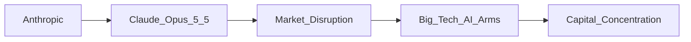

# Claude Opus 5.5: Un hito en la evolución de los modelos de IA

La release de **Claude Opus 5.5** por parte de **Anthropic** no es solo otro avance técnico; marca un punto de inflexión en la competencia por el control del mercado de inteligencia artificial (IA). Con capacidades superiores en razonamiento multimodal y una arquitectura optimizada para inferencia de bajo consumo, el nuevo modelo desafía la hegemonía de los grandes gigantes tecnológicos. Este artículo analiza, desde una perspectiva crítica, cómo **Claude Opus 5.5** está influenciando la distribución del poder, la concentración de capital y las dinámicas económicas en la industria.

## Un breve recorrido histórico

Para entender el impacto actual, es necesario retroceder a las fases clave de la historia de la informática. En la era de los mainframes (1960‑1970), el poder estaba centralizado en pocos proveedores de hardware. La revolución del software **independent software vendors (ISVs)** redistribuyó el poder hacia editoriales de sistemas operativos, creando un ecosistema más fragmentado. La década de los 90 tuvo su pico con la apertura de los estándares web, donde **Microsoft** y **IBM** lucharon por el dominio del navegador y del servidor, mientras que emergían startups como **Netscape**.

La explosión del **dot‑com** y la posterior llegada del **cloud computing** (Amazon Web Services, Microsoft Azure, Google Cloud) consolidaron la concentración de infraestructura en tres proveedores. Este patrón de “oligopolio en la nube” creó barreras de entrada que, a su vez, fomentaron la aparición de gigantes de IA como **OpenAI**, **DeepMind** (Google) y **Meta** (Facebook). Cada uno de estos jugadores invirtió capitales multimillonarios en hardware especializado, datos y talento, consolidando una posición de monopolio parcial en sus nichos.

## La aparición de Claude Opus 5.5

**Claude Opus 5.5** representa la última iteración de la familia de modelos de lenguaje de **Anthropic**, una empresa fundada en 2021 por ex‑empleados de **Google Brain**. A diferencia de sus competidores, Anthropic ha adoptado un enfoque de “IA segura”, enfatizando alineación de valores y transparencia. La versión 5.5 introduce mejoras sustanciales en:

- **Razonamiento multimodal**: integración de texto, imagen y datos estructurados sin pérdida de precisión.
- **Eficiencia energética**: consumo de energía reducido en un 30 % frente a la versión 5.0, lo que abre la puerta a despliegues a mayor escala.
- **Interactividad con APIs abiertas**: facilita la integración en plataformas de terceros, desde startups fintech hasta empresas de salud.

Estas características no solo compiten directamente con los modelos de **OpenAI** (GPT‑4, GPT‑4 Turbo) y **Google** (Gemini), sino que también ofrecen una alternativa viable para quienes buscan evitar la dependencia de ecosistemas cerrados.

## Reconfiguración del poder en la cadena de valor

### 1. **De la energía del capital a la energía de la regulación**

Hasta ahora, la dominación del mercado de IA se ha financiado principalmente por inversiones de capital de riesgo y fondos soberanos. Empresas como **Microsoft** (con su alianza con OpenAI) y **Amazon** (inversión en Anthropic) han destinado miles de millones de dólares a la investigación y al desarrollo de modelos de base. Sin embargo, la llegada de Claude Opus 5.5 ha introducido una nueva variable: la capacidad de un actor relativamente pequeño (Anthropic) para ofrecer un modelo de alto rendimiento a precios competitivos.

Esto ha despertado la preocupación de los reguladores europeos y estadounidenses, quienes temen que la competencia se vea erosionada si un número reducido de empresas controla tanto la capa de modelos como la de infraestructura subyacente. La **regulación de la IA** está empezando a centrarse en la “interoperabilidad de modelos” como un objetivo de política pública, precisamente para evitar que la concentración de poder se transfiera de la infraestructura a los algoritmos.

### 2. **Efectos en los desarrolladores y el ecosistema de terceros**

Los **desarrolladores** son los principales beneficiarios de la apertura de Claude Opus 5.5. La API pública, bajo licencias más permisivas que las de algunos modelos cerrados, permite a startups crear productos diferenciados sin infringir patentes extensas. Por ejemplo, empresas de **fintech** están integrando el modelo para análisis de riesgo crediticio, mientras que startups de **educación** lo usan para tutores personalizados.

Este flujo de nuevos usuarios genera un efecto de red: más datos de entrenamiento, mejoras continuas y una mayor presión sobre los competidores para ofrecer funcionalidades adicionales. La dinámica recuerda a la era de los navegadores en los años 90, cuando la apertura de **Mozilla** y **Opera** forzó a **Microsoft** a mejorar su propio producto.

## Concentración de capital y estrategias corporativas

### 1. **Alianzas estratégicas y adquisiciones**

Los gigantes tecnológicos están respondiendo con varias tácticas:

- **Microsoft** ha ampliado su inversión en Anthropic, buscando asegurar un acceso preferencial a futuras versiones de Claude.
- **Google** ha intensificado su colaboración con **DeepMind** y ha lanzado su propio modelo **Gemini** con enfoque en seguridad.
- **Meta** ha creado un equipo interno de “IA soberana” para reducir la dependencia de proveedores externos.

Estas alianzas no solo garantizan suministro de talento, sino que también sirven como palancas para negociar condiciones de uso de la infraestructura en la nube. En esencia, el poder económico se está redistribuyendo no solo entre proveedores de modelos, sino también entre los **proveedores de nube** que albergan estos modelos.

### 2. **Financiamiento y capital de riesgo**

Los fondos de capital de riesgo han destinado más del 35 % de sus inversiones en IA a startups que desarrollan modelos de base con enfoques de “seguridad”. La aparición de Claude Opus 5.5 ha aumentado la valoración de Anthropic, que alcanzó los **$30 mil millones** en su última ronda Serie D. Este monto supera la cantidad total invertida en la mayoría de las **startups de IA** en el último año, lo que indica una mayor concentración de capital en un número reducido de actores.

## Conexión con tendencias históricas

La dinámica actual evoca la **revolución de los estándares abiertos** de los 90, cuando la comunidad de código abierto impulsó la interoperabilidad y desafió a los monopolios propietarios. En aquella época, la publicación de **HTML** y **HTTP** permitió una expansión explosiva de la web, democratizando el acceso a información y servicios. Hoy, la publicación de **modelos abiertos** (p.ej., en Hugging Face) y la disponibilidad de APIs de modelos como Claude Opus 5.5 están catalizando una similar apertura, aunque con un matiz crítico: la **CONCENTRACIÓN** de recursos sigue siendo alta.

Sin embargo, la diferencia esencial radica en la **regulación emergente**. Los gobiernos están empezando a examinar los acuerdos de exclusividad entre proveedores de nube y desarrolladores de IA, con el objetivo de preservar la competencia y evitar que la **carrera por el poder** se convierta en una carrera por el control absoluto del dato y la computación.

## Conclusión: reflexión para el futuro

En resumen, **Claude Opus 5.5** no es solo un hito técnico; es un catalizador que está remodelando las relaciones de poder dentro de la industria de la IA. La capacidad de Anthropic para ofrecer un modelo seguro, eficiente y accesible está desafiando la hegemonía de los gigantes tecnológicos, al tiempo que genera nuevas presiones sobre la concentración de capital y la regulación.

La pregunta que queda en el aire es: ¿hasta qué punto será sostenible la apertura de estos modelos sin que el poder económico se transfiera a nuevas formas de monopolio? La respuesta dependerá de la capacidad de la comunidad de desarrolladores, de los reguladores y de los propios actores del mercado para equilibrar **innovación** y **equidad**.

*¿Qué papel crees que deberían jugar las políticas públicas en la distribución del poder dentro de la IA?*

