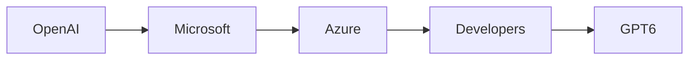

# Los Avatares Dúales de GPT‑6: Un Punto de Inflexión para el Poder de la IA y el Capital

El lanzamiento de **GPT‑6 Sol** y **GPT‑6 Luna** marca más que un hito técnico; señala una maniobra estratégica por **OpenAI** que remodela el panorama competitivo de la **inteligencia artificial**. Aunque los modelos exhiben capacidades multimodales sin precedentes, la narrativa acompañante se centra en la **concentración de capital**, **alianzas corporativas** y el sutílareequilibrio de influencia entre los gigantes tecnológicos que los financian.

## La Anatomía de un Lanzamiento

OpenAI introdujo las dos variantes como personalidades distintas: **Sol**, un modelo “sol‑como”optimizado para inferencia de alta capacidad y bajo costo; **Luna**, un modelo “luna‑como”orientado a la generación creativa y matizada. Al segmentar la línea de productos, la empresa obliga a los desarrolladores a elegir entre dos niveles de suscripción, cada uno con precios diferentes en la **API** hospedada en **Azure**. Esta estrategia de precios no es sola una táctica de marketing; es un movimiento calculado para bloquear el **consumo en la nube** y reforzar el papel de **Microsoft** como proveedor de infraestructura principal.

## Relaciones de Poder en el Ecosistema de la IA

La **relación** entre **OpenAI**, **Microsoft** y los desarrolladores downstream puede visualizarse como una **red de dependencias**. OpenAI depende de Azure de Microsoft para cómputo, almacenamiento y redes; a su vez, Microsoft obtiene un flujo constante de **cargas de trabajo de IA** que justifican sus inmensas inversiones en centros de datos. Los desarrolladores, hambrientos por las últimas capacidades, se convierten en el conducto que traduce el capital corporativo en innovación accesible al usuario final.

## Flujo de Capital y Concentración del Mercado

Los fundamentos financieros de **GPT‑6 Sol** y **Luna** son reveladores. Según registros públicos, OpenAI aseguró **5 mil millones de dólares** adicionales en capital de riesgo de un consorcio que incluye a **Sequoia Capital**, **Andreessen Horowitz** y **Thrive Capital**. Una parte sustancial de este financiamiento está destinada a la **compra de GPUs** y a **instancias reservadas en Azure**, canalizando eficazmente el capital privado hacia los servicios de nube de Microsoft. Este ciclo de capital muestra cómo el **dinero de venture** se está desviando cada vez más hacia los **propietarios de infraestructura** en lugar de los laboratorios de investigación de código abierto.

Desde la perspectiva de la industria, tal concentración plantea preocupaciones antimonopolio. Algunas corporaciones ahora controlan tanto el **desarrollo de modelos** (OpenAI, Anthropic, Google DeepMind) como los **recursos de cómputo** (Microsoft Azure, Google Cloud, Amazon Web Services). La **cuota de mercado** de los servicios de nube habilitados por IA ha pasado del **15 %** en 2018 a más del **45 %** en 2024, con **Azure** representando aproximadamente el **30 %** de las cargas de trabajo de IA que entrenan y sirven modelos como **GPT‑6**.

## Contexto Histórico: De los Laboratorios Académicos a los Corporativos

La transición de los **laboratorios académicos de IA** a **ramas corporativas de investigación** se remonta a principios de los años 2000, cuando los financiamientos de **DARPA** y **NSF** disminuyeron y las empresas comprendieron que la IA podía monetizarse a gran escala. **DeepMind**, adquirido por **Google** en 2014, ejemplifica esta transformación: una entidad de investigación antes independiente ahora funciona como un **activo estratégico** para las divisiones de publicidad y cloud de su matriz. La evolución de OpenAI sigue una trayectoria similar, pero con un giro: la organización se posiciona deliberadamente como una **IA benéfica** mientras se inserta en un **ecosistema cloud de fines comerciales**.

Este trasfondo histórico subraya una tensión central: la **promesa de una IA descentralizada y abierta** frente a la **realidad de un control concentrado** sobre el hardware y los canales de distribución que hacen posible esa IA.

## Implicaciones Competitivas para los Rivales

El lanzamiento de **GPT‑6 Sol** y **Luna** obliga a los competidores a responder en múltiples frentes:

1. **Presión de precios** – Con la tarificación por niveles de la API de OpenAI, rivales como **Anthropic** y **Meta** deben reducir sus tarifas o diferenciarse mediante conjuntos de funciones únicos (por ejemplo, **herramientas de Responsable IA**).
2. **Migración de talento** – El atractivo de trabajar en modelos de vanguardia que se ejecutan en **Microsoft Azure** atrae a los principales investigadores alejados de **Google DeepMind** y **Amazon Lab1**.
3. **Bloqueo del ecosistema** – Los desarrolladores que adoptan los **SDKs** de OpenAI a menudo se encuentran atados a la **autenticación y facturación** de **Azure**, lo que dificulta migrar a nubes alternativas.

Estas dinámicas refuerzan una situación de **ganador‑toma‑todo**, donde la **concentración del mercado** se acelera mientras un número reducido de firms domina tanto la **capa de modelos** como la **capa de infraestructura**.

## Realidades Económicas: El Costo de Entrenar y Servir

Entrenar un modelo de la magnitud de **GPT‑6** requiere **exabytes** de cómputo, lo que se traduce en **cientos de millones** de dólares en depreciación de hardware y electricidad. La **economía de escala** implica que solo unas pocas entidades pueden asumir este peso. En consecuencia, las iniciativas de **código abierto**, aunque filosóficamente atractivas, a menudo luchan por obtener financiamiento sostenido, generando un **bucle de retroalimentación** en el que los laboratorios corporativos se convierten en la principal fuente de innovación.

## Consideraciones Regulatorias y Éticas

A medida que los debates sobre **regulación de la IA** se intensifican en la UE y EE. UU, la **estructura de propiedad** de modelos como **GPT‑6 Sol** y **Luna** se vuelve un punto focal. Si una sola corporación controla los modelos más avanzados y los recursos de cómputo subyacentes, las **implicaciones de política** pasan de “regular las salidas de IA” a “regular el acceso a la IA”. Esta concentración podría empoderar a los reguladores para targetear **contratos de cloud de Microsoft** o los **acuerdos de licencia de OpenAI**, potencialmente remodelando el panorama competitivo.

## El Papel de los Desarrolladores: Guardianes del Poder

En última instancia, **los desarrolladores** ocupan el nexo de esta red de poder. Su elección de API, plan de precios y arquitectura de integración determina el alcance con el que los modelos de **OpenAI** se proliferan entre empresas, startups e investigadores independientes. Al incentivar la adopción del **modelo dual**, OpenAI no solo diversifica sus fuentes de ingreso, sino que también crea un **ecosistema binario** que puede ser aprovechado para productos downstream, desde **chatbots empresariales** hasta **plataformas de contenido creativo**.

## Conclusión: Reflexiones sobre una Industria en Transición

El debut de **GPT‑6 Sol** y **Luna** es un microcosmos de la **industria de la IA**: una combinación de brillantez técnica, asignación estratégica de capital y una reconsolidación del poder entre unos pocos conglomerados tecnológicamente sofisticados. A medida que el **capital de riesgo** sigue fluyendo hacia la **IA centrada en la nube**, las líneas entre **investigación**, **producto** e **infraestructura** se difuminan, insinuando un futuro donde la **concentración del mercado** pueda convertirse en la característica definitoria del campo.

Para observadores y participantes por igual, la idea clave es clara: la **próxima ola de avances en IA** estará moldeada en menor medida por la novedad algorítmica y en mayor medida por **quienes controlan los lentes** a través de los cuales se llevan a la práctica estos avances. La pregunta persiste: ¿la industria abrazará un modelo más **descentralizado**, o continuará orbitando alrededor de un número reducido de entidades **pesadas en capital**?