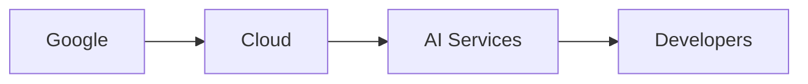

“Attention Is All You Have” apareció por primera vez en Hacker News en septiembre 2026, enlazando a un blog de investigación que trazaba la línea intelectual de la arquitectura transformer hasta los primeros mecanismos de atención en redes neuronales. El artículo provocó una ola de comentarios porque encuadró un hito técnico como un punto de inflexión cultural. Lo que realmente destacó no fue solo un nuevo modelo, sino un cambio en la forma en que se crea, captura y distribuye el valor a lo largo del ecosistema tecnológico.

La innovación central del transformer —el uso de auto‑atención para procesar secuencias— eliminó la necesidad de estructuras recurrentes y abrió la puerta a una escala masiva. En cuestión de meses, varios de los pesos pesados de la industria lanzaron modelos basados en esa base: BERT de Google, RoBERTa de Meta, los servicios basados en GPT‑4 de Amazon y la colaboración de Microsoft con OpenAI. Cada uno de estos lanzamientos estuvo acompañado de una oleada de ofertas posteriores: APIs de nube, hardware especializado y acuerdos de licencias empresariales. La ruptura técnica se Transformó rápidamente en un activo estratégico, reforzando la dominio de unas pocas empresas que ya controlaban la infraestructura subyacente.

Tomamos a Google, por ejemplo. Su división DeepMind no solo pionero en técnicas de aprendizaje por refuerzo, sino que también posee la mayor colección de TPU (Unidades de Procesamiento Tensor) dedicadas a cargas de trabajo de IA. Al integrar modelos transformer en servicios esenciales como Búsqueda, Anuncios y recomendaciones de YouTube, Google convierte los avances de investigación en flujos de ingresos inmediatos. La organización de investigación de IA de Meta, ampliamente financiada por su imperio publicitario, libera bibliotecas de código abierto que sirven tanto como herramientas de reclutamiento como formas de influir en la dirección del ecosistema. La plataforma SageMaker de Amazon abstrae gran parte del cómputo subyacente, permitiendo a desarrolladores de terceros construir sobre su infraestructura mientras alimentan datos a los algoritmos de comercio electrónico y logística de Amazon. Microsoft, a través de su nube Azure y la inversión estratégica en OpenAI, se ha posicionado como el proveedor predeterminado para cargas de trabajo de IA de nivel empresarial.

Estas estructuras revelan una dinámica económica más profunda: los datos y el cómputo se están convirtiendo en el nuevo petróleo, y las empresas que controlan las tuberías extraen valor desproporcionado. El capital de riesgo fluye hacia startups que prometen “democratizar la IA”, pero las empresas dominantes adquieren proyectos prometedores, los integran en sus propias pilas y siguen ampliando la brecha. El resultado es un mercado donde los efectos de red se acumulan: cuanto más usuarios atrae un servicio, más datos reúne, mejores son sus modelos y más difícil es que entren nuevos competidores. Este ciclo virtuoso para los incumbentes se parece más a una estrategia de bloqueo para la industria en general.

Históricamente, tal concentración ha suscitado escrutinio regulatorio. La desintegración de AT&T en los años 80, los casos antimonopolio contra Microsoft en los 90 y las recientes investigaciones sobre las prácticas de ad‑tech de Google ilustran cómo los gobiernos intentan restablecer la competencia cuando el poder de mercado perjudica la innovación y la elección del consumidor. En el ámbito de la IA, sin embargo, la caja de herramientas regulatoria parece insuficiente. La legislación antimonopolio se diseñó para productos con precios claros y alternativas sustituibles; los servicios de IA a menudo combinan software, datos y hardware en una oferta única y opaca. Además, la velocidad del despliegue tecnológico supera los procesos legislativos, dejando brechas que pueden ser explotadas.

La narrativa “attention is all you have” también subraya una paradoja: el mismo mecanismo que impulsa el procesamiento descentralizado y distribuido también concentra el poder de decisión en manos de quienes controlan la economía de la atención. En este contexto, la atención no es solo participación del usuario, sino el foco de investigadores, ingenieros e inversores que se dirigen a los proyectos más visibles y bien financiados. Esta atracción gravitatoria puede marginar enfoques alternativos que podrían fomentar una propiedad más distribuida de las capacidades de IA.

¿Qué significa esto para el futuro del desarrollo de IA? Si la trayectoria actual sigue sin control, corremos el riesgo de un panorama en el que unas pocas corporaciones dictan no solo los estándares técnicos, sino también los marcos éticos y económicos en los que opera la IA. Esa situación limitaría el pluralismo en la investigación de IA, concentraría la riqueza y podría erosionar la confianza del público en las tecnologías emergentes.

El mensaje ultimate del artículo, por tanto, es un llamado a la vigilancia. Reconocer los patrones históricos que modelan las estructuras de poder tecnológico puede informar políticas, decisiones de inversión y activismo comunitario. Puede inspirar a las partes interesadas —desde ingenieros hasta legisladores— a buscar mecanismos que preserven la apertura, diversifiquen la propiedad y garanticen que los beneficios de la IA transformadora se compartan ampliamente.

Al cierre, la historia de “attention is all you have” es más que una nota técnica; es una lente a través de la cual podemos observar la reconfiguración continua del ecosistema tecnológico. Se invita a los lectores a reflexionar sobre cómo la concentración de capital, la arquitectura del poder y la economía de la atención se intersectan, y a considerar qué acciones colectivas podrían equilibrar la innovación con un crecimiento equitativo.

