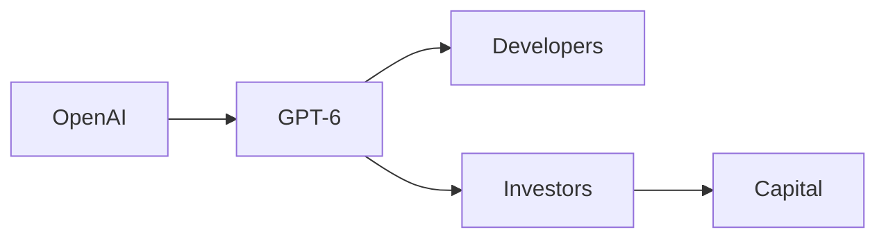

# GPT‑6 Sol y Luna: El Juego de Poder de la IA y su Impacto Económico

La noticia de **GPT‑6 Sol y Luna** ha encendido los focos de la comunidad tecnológica. Más que un simple upgrade, la versión combina dos gigantes: “Sol”, un modelo de razonamiento avanzado, y “Luna”, una interfaz orientada a la creatividad. Sin embargo, detrás del brillo de los avances técnicos se esconde una movida de **concentración de capital** que merece un examen crítico.

## 1. El anuncio y sus implicaciones estratégicas  

OpenAI, respaldada por **Microsoft**, ha posicionado a GPT‑6 como la pieza central de una estrategia que busca consolidar su dominio en la **inteligencia artificial generativa**. El comunicado oficial subraya que Sol “optimiza la lógica empresarial” mientras Luna “potencia la expresión artística”. Ambas facetas están diseñadas para ampliar la **participación de mercado** y atraer a inversores institucionales que buscan retornos rápidos.

> *“Con Sol y Luna, redefinimos la frontera entre la toma de decisiones y la creación de contenido.”*  
> — Sam Altman, CEO de OpenAI

## 2. poder y concentración de capital  

El mercado de modelos de lenguaje está dominado por un pequeño número de jugadores: **Google (DeepMind), Meta (AI), Amazon (Bedrock)** y **OpenAI**. Cada uno cuenta con **millones de dólares en financiación** y con infraestructura de computación en la nube que les otorga una ventaja insustituible. La llegada de GPT‑6 intensifica esta dinámica al:

1. **Aumentar la barrera de entrada** para startups que aspiran a competir en calidad.
2. **Fijar precios** de API basados en la capacidad de cómputo de los datos de entrenamiento, lo que favorece a los gigantes con recursos ilimitados.
3. **Crear redes de dependencia** entre desarrolladores y la plataforma de OpenAI, dado que la mayoría de las integraciones se basan en sus SDKs.

## 3. Relaciones de poder entre compañías  

- **OpenAI ↔ Microsoft**: La alianza estratégica permite a Microsoft acceder a la tecnología de IA de vanguardia a cambio de una participación accionarial. Esta relación se traduce en la integración de GPT‑6 en Azure, fortaleciendo la posición de Microsoft frente a competidores como Google Cloud.
- **OpenAI ↔ Desarrolladores**: La documentación y los kits de desarrollo (SDK) de GPT‑6 están diseñados para ser fácilmente adoptables, pero también para crear una **dependencia encadenamiento**. Los proyectos que dependen de la API de OpenAI pueden verse penalizados si cambian a otra solución.
- **OpenAI ↔ Inversores**: Los fondos de capital riesgo (VC) ven en GPT‑6 una oportunidad de **alto rendimiento**. Los términos de la ronda de financiación incluyen cláusulas que favorecen a los inversores institucionales, lo que a su vez presiona a OpenAI a priorizar productos con rápido retorno económico.

## 4. Conexión con tendencias históricas  

- **Los años 70‑80**: Las grandes empresas de software (IBM, Microsoft) controlaban gran parte del mercado de sistemas operativos mediante licencias restrictivas.
- **Los 90‑2000**: La era de internet favoreció a los gigantes de la publicidad digital (Google, Yahoo) que monetizaban el tráfico mediante algoritmos de búsqueda.
- **Hoy**: La IA generativa sigue la misma trayectoria: **capital, datos y escala** son los nuevos activos estratégicos.

## 5. Impacto económico real  

El precio de la computación en la nube ha caído, pero el **costo de entrenar modelos de última generación** sigue siendo prohibitivo para la mayoría de las organizaciones. Según un informe de la consultora **IDC**, el gasto global en IA alcanzó los **$500 mil millones** en 2023, con una parte significativa destinada a **infraestructura de GPU** suministrada por Nvidia. La disponibilidad de GPT‑6 impulsa aún más esa demanda, lo que a su vez eleva los precios de los chips y perpetúa la dependencia de pocos proveedores.

## 6. Repercusiones para los desarrolladores  

Los programadores que construyen aplicaciones sobre GPT‑6 se ven atrapados en un **ecosistema cerrado**. Algunas consecuencias:

- **Costos de migración**: Cambiar a otro modelo implica reescribir extensas capas de código.
- **Restricciones de uso**: Las licencias de API pueden prohibir ciertos tipos de aplicaciones, limitando la innovación.
- **Monopolio de datos**: Los datos de interacción que los usuarios generan alimentan el proceso de afinamiento, creando un círculo virtuoso que favorece a OpenAI.

## 7. Conclusión: ¿Hacia dónde vamos?  

La llegada de **GPT‑6 Sol y Luna** no es solo un hito técnico; es un catalizador de **dinámicas de poder** que remodelan la economía de la IA. La concentración de capital en manos de unas pocas corporaciones plantea preguntas sobre la **sostenibilidad** de la innovación abierta. ¿Podemos imaginar un futuro donde la IA sea un recurso público, o al menos una esfera menos dependiente de intereses corporativos?

Invitamos a la comunidad a reflexionar sobre el papel de la regulación, la **colaboración abierta** y la **diversificación de proveedores** para evitar que el poder quede demasiado concentrado. Solo así podremos asegurar que la IA sirva a intereses más amplios que los de los accionistas.

---

