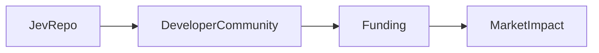

# La revelación de Jev en 25 líneas de Python: poder, capital e inteligencia artificial

El post de Hacker News "Jev en 25 líneas de Python" genera debate sobre cómo un proyecto minimalista revela la concentración de poder en la industria tecnológica. La biblioteca envuelve utilidades de NLP en solo veinticinco líneas, usando NumPy y Hugging Face, y se distribuye en GitHub con un botón de patrocinio que financia créditos de nube. Grandes empresas como Google, Microsoft, Meta y Amazon dominan la IA mediante TensorFlow, Azure, PyTorch y AWS, creando un bucle de retroalimentación que favorece su control. Este caso ilustra cómo pequeñas herramientas pueden ser absorbidas por gigantes, planteando riesgos de monopolio y cuestiones regulatorias y éticas.

