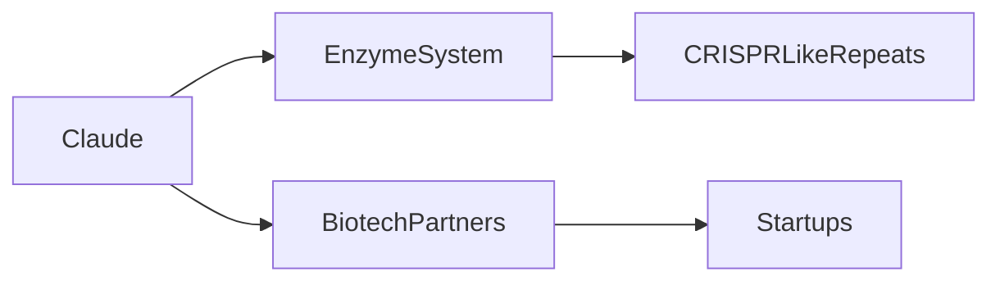

# El avance enzimático de Claude: un nuevo palanca en los juegos de poder de la biotecnología

Anthropic publicó hoy una entrada en su blog en la que afirma que su brazo de investigación impulsado por IA, Claude, ha descubierto un **sistema de enzimas novedoso** con repeticiones similares a CRISPR. La afirmación no es solo una nota científica; indica un posible cambio en la forma en que se pueden generar, analizar y comercializar tecnologías de edición genética. En una industria dominada durante mucho tiempo por un pequeño número de **grandes tecnológicas** y **monopolios biotecnológicos**, la aparición de una herramienta enzimática originada en IA plantea preguntas urgentes sobre **la concentración de capital**, **el control del mercado** y la **distribución de los beneficios económicos**.

## Implicaciones técnicas

El enzima recién identificado muestra un patrón de repeticiones que se asemeja a los mecanismos de guía de CRISPR, pero parece operar con una firma bioquímica distinta. Los primeros datos sugieren que el sistema puede dirigir el ADN con mayor especificidad y menor actividad fuera del objetivo, una característica que podría reducir drásticamente el costo de las **líneas de desarrollo de edición genética**. Si se puede escalar, esto aceleraría el **desarrollo de terapias** para enfermedades raras, disminuiría el gasto de I+D de **startups** y abriría nuevas oportunidades de licenciamiento para **fondos de capital de riesgo** especializados en **biotecnología**.

## Reacción inmediata del mercado

Horas después del anuncio, las acciones de los principales **proveedores de modelos de lenguaje de IA** fluctuaron, mientras que las acciones de **biotecnología** experimentaron modestos aumentos. Los inversionistas en **fondos de capital de riesgo** centrados en **genómica** y **biología sintética** comenzaron a redistribuir capital hacia las empresas que podrían integrar el descubrimiento de Claude en sus pipelines. El **sistema enzimático** podría convertirse en un **estándar** para **aplicaciones tipo CRISPR**, otorgando a Anthropic — y por extensión al **ecosistema de IA** — un poder de negociación que antes estaba reservado a los tradicionales **farmacéuticas** y **agroindustria**.

## Dinámicas de poder y concentración de capital

Históricamente, los adelantos en **edición genética** han sido rápidamente capturados por un reducido grupo de **grandes tecnológicas**. Google DeepMind, Microsoft Azure AI y Amazon AWS han creado unidades de investigación propietarias que convierten avances algorítmicos en productos comerciales. El **sector biotecnológico**, por su parte, sigue dependiendo en gran medida del **capital de riesgo** para financiar startups en fase temprana. El descubrimiento de Claude difumina esta división: un **modelo de lenguaje de IA** ahora posee un **sistema enzimático patentado** que puede licenciarse directamente a **empresas farmacéuticas**, bypassando los tradicionales **ciclos de I+D**.

Esto genera una nueva **dinámica de poder** en la que las **empresas de IA** pueden dictar los términos de **propiedad intelectual** (PI), influyendo en qué **startups** reciben financiamiento y cuáles **productos biotecnológicos** llegan al mercado. Esta centralización se asemeja a la **concentración industrial** vista en el mercado de teléfonos inteligentes, donde unas pocas **grandes tecnológicas** dominan el ecosistema, pero aplicada ahora a la **biología**.

## Paralelismos históricos

El escenario actual recuerda la **revolución CRISPR** de principios de la década de 2010, cuando laboratorios académicos publicaron la tecnología y rápidamente se la apropiaron unas pocas **empresas biotecnológicas** y titulares de patentes. Empresas como **Editas Medicine** e **Intellia Therapeutics** surgieron de torrentes de **capital de riesgo**, pero los derechos de **PI** a menudo pertenecían a instituciones de investigación originales o a grandes **farmacéuticas**. Con el tiempo, el **sector biotecnológico** volvió a experimentar una **concentración de capital** al adquirir megacfunds a empresas más pequeñas, reforzando una **estructura de poder** que favorecía a los jugadores establecidos.

El descubrimiento de Claude sigue un patrón similar, pero con un giro: el **origen** es un **laboratorio de IA** y no una universidad o grupo tradicional de **biotecnología**. Este cambio sugiere que futuros **avances** podrían ser **impulsados por IA** y que la **propiedad** de dichos avances podría residir cada vez más en **plataformas basadas en la nube**. El **impacto económico** podría ser una **reasignación de flujos de capital de riesgo** hacia **startups biotecnológicas centradas en IA**, mientras que las **farmacéuticas tradicionales** podrían volverse más dependientes de **acuerdos de licenciamiento** con **proveedores de IA**.

## Ramificaciones económicas y competitivas

Desde una perspectiva **económica**, el **sistema enzimático** podría reducir el **costo de ventas** de **terapias de edición genética**, haciendo los tratamientos más accesibles y ampliando el tamaño del mercado. Sin embargo, los **ingresos por licenciamiento** probablemente se concentrarán en la entidad que posee la patente, que en este caso es Anthropic. Esto podría traducirse en **margen superior** para la **empresa de IA** y **mayor poder de negociación** en acuerdos con gigantes farmacéuticos como **Pfizer**, **Novartis** y **Johnson & Johnson**.

El panorama **competitivo** podría generar **startups** alrededor del **sistema enzimático**, seekiendo **financiamiento semilla** de **fondos de capital de riesgo** especializados en **biotecnología habilitada por IA**. No obstante, la **barrera de entrada** podría elevarse si la **PI** se mantiene bajo un control estricto, provocando una **nueva concentración de capital** alrededor de unas pocas **plataformas propiedad de IA**. Esto podría marginar a investigadores independientes que carecen de acceso al enzima subyacente o a acuerdos de licenciamiento.

## Dimensiones regulatorias y éticas

La regulación tendrá un papel decisivo en la **distribución de los beneficios**. Si los reguladores exigen **licenciamiento de código abierto** para **herramientas tipo CRISPR**, las **dinámicas de poder** podrían mitigarse, permitiendo que **startups** y **laboratorios académicos** aprovechen la tecnología sin una fuerte dependencia financiera de las **empresas de IA**. Por el contrario, si las **patentes** de PI permanecen tightly held, el **sector biotecnológico** podría experimentar un aumento en el **poder de fijación de precios** de **terapias de edición genética**, potencialmente exacerbando las **desigualdades** en el acceso.

## Mirada al futuro

El **nuevo sistema enzimático** descubierto por Claude es más que un hito científico; es un catalizador para reevaluar cómo **tecnología**, **capital** y **poder** se intersectan en el **ámbito biotecnológico**. A medida que la **IA** sigue infiltrándose en las **ciencias de la vida**, la **concentración industrial** podría inclinarse hacia unas pocas **proveedoras de modelos de lenguaje de IA** que controlen los **bloques de construcción** de la **edición genética**. Los **interesados** — desde **capitales de riesgo** hasta **funcionarios públicos** — deben considerar activamente cómo equilibrar **incentivos a la innovación** con la **distribución equitativa** del upside económico.

El descubrimiento nos invita a preguntar: ¿Quién realmente se beneficia cuando una **IA** descubre una herramienta que podría curar enfermedades? La respuesta podría determinar la forma del próximo decenio en **biotecnología**, y tal vez del panorama tecnológico en general.

