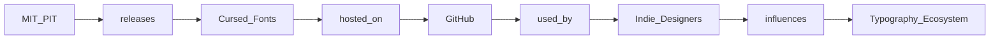

## Introducción  

En la sección *Show HN* de Hacker News apareció recientemente **“Make cursed fonts like Times New Bastard”**, un proyecto alojado en https://bastardica.mitpit.com que permite generar tipografías deliberadamente “malditas” (distorsionadas, inconsistentes o antihigiénicas) con un solo clic. A primera vista parece una curiosidad de nicho para diseñadores experimentales, pero el hecho de que haya surgido en una plataforma académica vinculada al MIT y que utilice infraestructura de código abierto plantea preguntas más amplias sobre **quién controla la tipografía digital**, cómo se monetiza y qué implicaciones tiene para la concentración de poder en la industria tecnológica.

Este artículo explora esas dimensiones: la relación entre gigantes del software (Google, Microsoft, Apple y Adobe), fundiciones tipográficas tradicionales (Monotype, Linotype), plataformas de código abierto y el emergente ecosistema de “cursed fonts”. A través de una mirada histórica y económica, veremos cómo un experimento de código abierto puede revelar tensiones estructurales que ya están remodelando la forma en que leemos y diseñamos la información en la era digital.

---

## 1. La tipografía como activo estratégico  

Durante la década de 1990, la **estandarización de fuentes** pasó de ser una preocupación de editoriales impresas a una cuestión central de los sistemas operativos. Microsoft incorporó *Times New Roman* y *Arial* como fuentes predeterminadas en Windows, mientras que Apple lanzó *Helvetica* y, más tarde, *San Francisco* para consolidar su identidad visual. Estas decisiones no fueron meramente estéticas; fueron **movimientos de capital** diseñados para evitar licencias externas, reducir costes y crear ecosistemas cerrados donde el control de la experiencia del usuario se mantuviera dentro de la empresa.

Con la llegada de la web, el modelo cambió. **Google Fonts** (lanzado en 2010) ofreció miles de tipografías libres de royalties, impulsando una **democratización aparente** del acceso a fuentes. Sin embargo, detrás del repositorio abierto yace una estrategia de **lock‑in**: los desarrolladores que usan Google Fonts a menudo terminan alojando sus sitios en Google Cloud, aceptando métricas de seguimiento y, en algunos casos, permitiendo al gigante recoger datos de uso de tipografía que alimentan algoritmos de IA para mejorar su publicidad.

En este contexto, el proyecto de *Times New Bastard* llega como una **intervención subversiva** que desafía la estética limpia y la funcionalidad utilitaria que las grandes plataformas han promovido. Al generar tipografías “malditas”, el proyecto no solo abre posibilidades creativas, sino que también cuestiona el **monopolio cultural** que las grandes corporaciones ejercen sobre la forma visual del texto.

---

## 2. Concentración de capital en el mercado de fuentes  

### 2.1 Los gigantes de la tipografía  

- **Monotype**: controla más del 30 % del mercado de fuentes comerciales, adquirió empresas como *Helvetica* y *FontShop*. Su cartera incluye licencias de uso para sistemas operativos y plataformas de diseño, lo que le otorga un **poder de precios** significativo.  
- **Adobe**: a través de *Adobe Fonts* (antes Typekit), combina suscripciones de Creative Cloud con una biblioteca de fuentes propietarias, creando **dependencia de suscriptores** que pagan por acceso a un ecosistema cerrado.  
- **Microsoft** y **Apple**: siguen manteniendo colecciones de fuentes propietarias integradas en sus sistemas, lo que obliga a diseñadores y desarrolladores a **licenciar** o **emular** esas fuentes para garantizar la consistencia visual.

### 2.2 El modelo de “freemium” y sus efectos  

Empresas como **Google** y **Adobe** ofrecen versiones gratuitas de fuentes, pero retienen la **versión premium** con características avanzadas (variable fonts, ligaduras especiales). Este modelo incentiva la adopción masiva de la versión gratuita mientras **monetiza** a usuarios avanzados y a organizaciones que necesitan licencias corporativas. El resultado es una **concentración de capital** donde la mayor parte del valor económico se queda en unas pocas manos, mientras que la mayoría de los usuarios experimenta una **ilusión de gratuidad**.

---

## 3. El auge del código abierto y los “cursed fonts”  

### 3.1 De la libertad a la captura de datos  

El movimiento de fuentes *open source* surgió como respuesta a la **restricción de licencias**. Proyectos como **Google Fonts** y **FontForge** permitieron a diseñadores compartir y modificar tipografías sin costes. Sin embargo, el código abierto es un **campo de batalla** donde grandes actores pueden “capturar valor”. Por ejemplo, Google emplea el **análisis de métricas de uso** de sus fuentes para optimizar su motor de búsqueda y sus algoritmos de IA, convirtiendo datos tipográficos en un activo comercial.

### 3.2 “Times New Bastard” como prueba de concepto  

La herramienta MIT Pit (Programmatic Interface Toolkit) detrás de *Times New Bastard* es **gratuita**, está alojada en GitHub y usa una **licencia permissiva** que permite su uso comercial sin royalties. Su valor real reside en:

1. **Descentralizar la creación de fuentes**: cualquiera puede generar una versión “maldita” sin depender de una fundición.
2. **Romper patrones de legibilidad**: al distorsionar la tipografía se ponen a prueba los algoritmos de OCR y los sistemas de IA que dependen de textos claros.
3. **Crear un “sandbox” para estudios de usabilidad**: empresas pueden evaluar cómo el “cursed typography” afecta la percepción del usuario, generando insights que podrían venderse a agencias de publicidad.

En otras palabras, lo que parece un experimento lúdico es, potencialmente, una **fuente de datos** que las grandes corporaciones podrían cooptar para entrenar modelos de IA, replicando el patrón de captura de valor visto en otras áreas del código abierto.

---

## 4. Dinámicas históricas: de la tipografía impresa a la tipografía programática  

| Época | Actor principal | Modelo de negocio | Resultado |
|------|----------------|-------------------|-----------|
| 1900‑1970 | Fundiciones tradicionales (Linotype, Monotype) | Licencias impresas, royalties por copia | Control rígido del mercado de tipografías |
| 1980‑1990 | Microsoft, Apple | Bundling de fuentes con sistemas operativos | Creación de “fuentes de sistema” como estándar de facto |
| 2000‑2015 | Google, Adobe | Freemium, web fonts, suscripciones | Democratización aparente, lock‑in mediante ecosistemas |
| 2020‑actual | Comunidades open source, proyectos académicos (MIT Pit) | Licencias permisivas, generación procedural | Descentralización técnica, riesgo de captura de datos |

Esta tabla muestra que la **tensión entre apertura y control** es una constante. Cada nueva ola tecnológica (impresión, digital, web, IA) trae consigo una **reconfiguración del poder**: los que poseen los canales de distribución (sistemas operativos, navegadores, plataformas de IA) pueden imponer estándares y capturar valor, mientras que los creadores de contenido (diseñadores, tipógrafos) a menudo quedan relegados a proveedores de bajo margen.

---

## 5. Implicaciones económicas reales  

1. **Valor de los datos tipográficos**: Cada vez que un usuario visita una página web que emplea una fuente especifica, se genera un *fingerprint* que los algoritmos de IA pueden usar para entrenar modelos de reconocimiento de patrones. Empresas como **Microsoft** y **Apple** ya están invirtiendo en *font‑based* biometría para mejorar la seguridad de dispositivos.  
2. **Externalidades negativas**: El uso masivo de fuentes “malditas” puede degradar la precisión de los sistemas de OCR en el sector público (digitalización de documentos gubernamentales), creando costos adicionales de corrección.  
3. **Barreras de entrada para pequeñas fundiciones**: Al requerir infraestructura de hosting, distribución y meta‑datos (Unicode, OpenType features), los costos fijos siguen siendo elevados. Los proyectos como *Times New Bastard* reducen la barrera técnica, pero la **competencia con gigantes que gestionan librerías globales** sigue siendo desbalanceada.

---

## 6. ¿Hacia dónde se dirige la industria tipográfica?  

La evolución reciente sugiere tres posibles escenarios:

1. **Consolidación intensiva**: Google, Adobe y Microsoft podrían integrar herramientas de generación procedural de fuentes (tipo *Bastardica*) dentro de sus suites, ofreciendo “cursed fonts” como una característica premium para marketing creativo.  
2. **Fragmentación y nicho**: Comunidades de código abierto mantendrían proyectos independientes, creando un ecosistema de fuentes “anti‑mainstream” que alimenta subculturas de diseño y protesta digital.  
3. **Regulación**: Ante la preocupación por la captura de datos y los impactos en la accesibilidad, organismos reguladores podrían exigir **transparencia en el uso de fuentes** y **restricciones de recopilación de métricas** en entornos web.

Cada vía implica diferentes **dinámicas de poder** y distribución de capital. La clave está en observar quién controla los *pipeline* de distribución (CDNs, navegadores) y quién posee los *datasets* de uso de tipografía.

---

## Conclusión  

*Times New Bastard* no es solo una herramienta para crear tipografías extravagantes; es una **mirada reveladora a la arquitectura de poder** que sostiene la industria tipográfica digital. A medida que la generación procedural de fuentes se vuelve más accesible, los gigantes tecnológicos encontrarán nuevas formas de **capturar valor** a través de datos y lock‑in, mientras que los diseñadores independientes pueden explotar la libertad creativa como forma de resistencia cultural.

La reflexión final que debemos hacer como usuarios, diseñadores y reguladores es: **¿qué precios estamos dispuestos a pagar por la libertad visual y la privacidad de nuestras interacciones tipográficas?** El futuro de la tipografía está en la intersección de la estética, la economía y la política del software. Decidir quién define esa intersección determinará, en última instancia, quién controla la forma en que leemos el mundo.