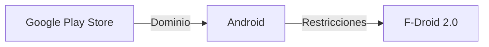

# F-Droid 2.0: una nueva capa de resistencia en el ecosistema Android

En septiembre de 2026, la comunidad de software libre celebró un hito: el lanzamiento de **F-Droid 2.0**, una versión renovada de la tienda de aplicaciones que, más allá de ofrecer paquetes de código abierto, plantea una agenda política que desafía directamente el dominio de Google y Apple en el mercado móvil. Este artículo explora cómo esta herramienta se inserta en una larga batalla por la soberanía digital, analiza las estructuras de poder que la rodean y contextualiza su aparición dentro de tendencias históricas de la industria tecnológica.

## Un breve recorrido histórico

Desde los inicios de Android, la **Google Play Store** se consolidó como el canal oficial para distribuir aplicaciones. A diferencia de la App Store de Apple, que siempre ha operado bajo un modelo cerrado, Google combinó una plataforma abierta con un marketplace centralizado. Esta dualidad permitió que, al mismo tiempo que los desarrolladores disfrutaran de una base amplia, el control sobre la visibilidad y la monetización se concentró en manos de la compañía de Mountain View.

A lo largo de la década de 2010, surgieron alternativas como **F-Droid**, una tienda enfocada exclusivamente en software libre que se alimentaba de repositorios descentralizados. Sin embargo, la versión original tenía limitaciones de interfaz y falta de sincronización con los dispositivos más recientes. La llegada de **F-Droid 2.0** supone una re‑ingeniería profunda: una arquitectura basada en microservicios, un motor de actualización más ágil y, sobre todo, una visión explícita de combatir la concentración de poder.

## La arquitectura del poder en la industria

1. **Google** – dueña de Android (el sistema operativo que alimenta más del 70 % de los smartphones del mundo) y de **Google Play Store**, que controla aproximadamente el 90 % de las descargas de aplicaciones. Su modelo de negocio depende de la monetización de datos y de comisiones sobre los ingresos de los desarrolladores (entre 15 % y 30 % según el ingreso).

2. **Apple** – controla el **App Store** y el ecosistema iOS, donde la cuota de mercado, aunque menor que la de Android, es altamente rentable. Apple impone políticas rígidas de revisión y cobro, lo que ha generado críticas sobre la “tienda como walled garden”.

3. **Microsoft** – aunque menos visible en el segmento móvil, su **Microsoft Store** y su empuje por la integración con Windows y Azure forman parte de una estratégia de diversificación que busca posicionarse como proveedor de servicios de nube para desarrolladores.

Estas empresas forman una **red de dependencia**:

El flujo de poder se manifiesta en el requisito de certificación de Google Play Services, que obliga a los fabricantes a preinstalar una serie de aplicaciones propietarias y a recabar datos de uso. Esta práctica, aunque aparentemente técnica, tiene un impacto económico: los ingresos publicitarios y de suscripciones se filtran a través de los servicios de Google, creando una **concentración de capital** que limita la entrada de alternativas competitivas.

## F-Droid 2.0 como respuesta estratégica

- **Actualizaciones descentralizadas**: los paquetes se distribuyen a través de un réseau peer‑to‑peer, eliminando la necesidad de un servidor central que pueda ser bloqueado o censurado.
- **Integración con repositorios de terceros**: los desarrolladores pueden publicar sus aplicaciones en múltiples fuentes sin depender de una única plataforma.
- **Modelo de monetización basado en donaciones y suscripciones opcionales**: no se aplican comisiones a los desarrolladores, lo que rompe el esquema de ingresos de Google Play.

Al eliminar la dependencia de **Google Play Services**, F-Droid 2.0 permite que los fabricantes de hardware (como Xiaomi, OnePlus o Realme) ofrezcan dispositivos con una capa de personalización más ligera y, potencialmente, sin los rastreadores de Google. Esto abre la puerta a una **soberanía digital** para usuarios que desean controlar sus datos y su entorno software.

## Conexión con tendencias históricas

F‑Droid 2.0 se sitúa en esta tradición de **resistencia tecnológica**, pero con un giro contemporáneo: no solo distribuye código, sino que también cuestiona la **economía de comisiones** y la **extracción de datos** que sustentan los modelos de negocios de los gigantes. La empresa **Google** ha respondido con iniciativas como **Play Asset Delivery** y **Play App Signing**, intentando cerrar la brecha, pero la exposición pública de sus prácticas de recopilación de datos ha alimentado el discurso crítico.

## Implicaciones económicas y de mercado

Desde una perspectiva macroeconómica, la llegada de una alternativa robusta como F‑Droid 2.0 podría generar **presión competitiva** sobre los precios y los servicios de pago. Los analistas predicen que, si al menos el 5 % de los usuarios migraran a tiendas alternativas, los ingresos publicitarios de Google Play podrían reducirse en aproximadamente **USD 1.2 mil millones** al año. Este número, aunque representa una fracción de su facturación total, sería suficiente para forzar cambios en sus políticas de comisión y en la manera en que gestionan los datos de usuarios.

Además, la aparición de una tienda verdaderamente **open source** incentiva a otras plataformas a adoptar modelos más transparentes. Por ejemplo, **Apple** ha comenzado a explorar la posibilidad de permitir la instalación de aplicaciones de fuentes externas en iOS, aunque bajo estrictas condiciones de seguridad. Este movimiento, aunque todavía incipiente, indica que la presión de la comunidad abierta está empezando a remodelar las políticas de los incumbentes.

## Desafíos y perspectivas futuras

A pesar del entusiasmo, F‑Droid 2.0 enfrenta varios obstáculos:

- **Fragmentación del mercado**: la diversidad de versiones de Android y de fabricantes complica la distribución uniforme de paquetes.
- **Experiencia de usuario**: la curva de aprendizaje para usuarios no técnicos sigue siendo más alta que la de Google Play.
- **Sostenibilidad financiera**: mantener servidores y desarrollo requiere recursos que no provienen de anuncios ni de comisiones.

Para superar estos retos, la comunidad está explorando **modelos de co‑creación** con desarrolladores de terceros y **programas de financiación colectiva** que permitan escalar la infraestructura sin depender de capital de riesgo. Además, la reciente regulación europea sobre **Digital Markets Act (DMA)** obliga a los gatekeepers a abrir sus plataformas a competidores, lo que podría catalizar una adopción más amplia de alternativas como F‑Droid.

## Conclusión: ¿hacia dónde nos dirige el ecosistema?

F‑Droid 2.0 no es solo una actualización técnica; es un símbolo de una **reconfiguración del poder** en la era digital. Al romper la dependencia de los monopolios de distribución, abre la puerta a una mayor **descentralización** y a una **soberanía digital** que muchos usuarios consideran esencial en la actualidad. La capacidad de esta herramienta para escalar dependerá de la colaboración entre desarrolladores, reguladores y consumidores conscientes.

Su llegada invita a reflexionar: ¿estamos preparados para aceptar un ecosistema donde el control no se concentra en unas pocas corporaciones, sino que se reparte entre comunidades globales? La respuesta a esta pregunta jugará un papel crucial en la forma en que se definirán los próximos capítulos de la industria tecnológica.

    Google[Google Play Store] -->|Dominio| Android[Android]
    Android -->|Restricciones| FDroid[F-Droid 2.0]