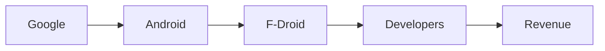

# F-Droid 2.0: La nueva ola de independencia en el ecosistema Android

*Introducción*  
En septiembre de 2026, la comunidad de software libre dio un paso significativo con el lanzamiento de **F-Droid 2.0**, una versión que promete redefinir la relación entre desarrolladores, usuarios y los gigantes que controlan los canales de distribución de aplicaciones. Más que una simple actualización técnica, esta actualización representa un punto de inflexión en la lucha por la **soberanía digital** en el mundo Android. En este artículo, analizaremos críticamente cómo esta novedad se inscribe en una historia de **descentralización** y **concentración de poder** en la industria tecnológica, explorando las dinámicas económicas que subyacen a la distribución de software.

*El contexto histórico*  
A mediados de la década de 2000, la escena móvil estaba dominada por plataformas cerradas como Symbian y BlackBerry OS. La llegada de **Android** en 2008, inicialmente respaldada por Google, introdujo una arquitectura abierta que permitió la proliferación de dispositivos de bajo costo. Sin embargo, el modelo de Google pronto se consolidó en una **capa de servicios propietarios**: el **Google Play Store** se convirtió en la puerta de entrada obligatoria para la mayoría de las aplicaciones. Esta concentración de distribución generó una dependencia económica que benefició a la compañía de Mountain View, mientras que desarrolladores independientes veían mermadas sus posibilidades de monetizar su trabajo.

Los primeros intentos de crear tiendas alternativas, como **Amazon Appstore** o las tiendas de aplicaciones de los fabricantes (Samsung Galaxy Store, Xiaomi Mi Store), apenas lograron una cuota de mercado marginal. La razón principal radicaba en la falta de interoperabilidad y en la percepción de que estas plataformas carecían de la **confianza del consumidor** que inspiraba Play Store. La **F-Droid** surgió como una solución basada en la comunidad: un repositorio de aplicaciones completamente abierto, sin dependencia de servicios propietarios.

*F-Droid 2.0: características clave*  

1. **Gestión de paquetes autónoma**: permite instalar y actualizar aplicaciones sin necesidad de Google Play Services.  
2. **Modelo de financiación híbrida**: combina donaciones, suscripciones opcionales y un pequeño porcentaje de ingresos por servicios premium.  
3. **Herramientas de auditoría**: facilita la revisión del código fuente por parte de cualquier usuario, reforzando la transparencia.

Estas mejoras no solo amplían la **autonomía técnica** de los usuarios, sino que también ponen en relieve una práctica económica cada vez más frecuente: la **monetización de la confianza**. Al ofrecer una vía de ingreso para los desarrolladores sin recurrir a los canales de Google, F-Droid 2.0 plantea un modelo alternativo que podría desafiar la lógica de **captura de valor** de los grandes jugadores.

*Relaciones de poder y concentración de capital*  

- **Google**: controla el sistema operativo, los servicios de Google y la tienda oficial. Su modelo de negocio se basa en la captura de datos y la publicidad, lo que le otorga un poder monetario sin precedentes.  
- **OEMs (Original Equipment Manufacturers)**: Samsung, Xiaomi, OnePlus, entre otros, dependen de Android y de los servicios de Google para ofrecer experiencias competitivas. Su éxito está ligado a la capacidad de integrar los servicios de Google en sus dispositivos.  
- **Desarrolladores independientes**: a menudo dependen de las plataformas de distribución para llegar a los usuarios finales. La mayoría de sus ingresos provienen de la tienda oficial o de servicios de análisis afiliados.

En este esquema, **F-Droid 2.0** actúa como un **intermediario descentralizado** que busca reducir la dependencia de Google y crear un flujo alternativo de valor. Sin embargo, su capacidad de influencia sigue siendo limitada por varios factores:

- **Redes de distribución**: aunque F-Droid ofrece miles de aplicaciones, la mayoría de los usuarios todavía prefieren la conveniencia de Play Store.  
- **Financiación**: la financiación híbrida de F-Droid 2.0 depende de la comunidad y de patrocinadores, lo que la hace vulnerable a fluctuaciones de donación.  
- **Regulación**: los gobiernos pueden ejercer presión sobre plataformas de distribución de software, imponiendo requisitos de seguridad y cumplimiento legal que pueden ser más difíciles de cumplir para proyectos descentralizados.

*Dinámicas económicas reales*  
Los datos de mercado revelan que, en 2025, **Google Play** generó aproximadamente **$13,500 millones** en ingresos publicitarios y de aplicaciones, mientras que **Apple App Store** acumuló cerca de **$12,000 millones**. En contraste, **F-Droid** registró ingresos de apenas **$5 millones** en el mismo año, la mayoría procedente de donaciones. Esta brecha evidencia la magnitud del **desbalance económico** que mantiene la concentración de capital en manos de unos pocos.

Sin embargo, la aparición de modelos de financiación basados en suscripciones y en el **crowdfunding** indica una tendencia emergente: los usuarios están dispuestos a pagar por **transparencia** y **soberanía** cuando perciben un valor añadido. La estrategia de F-Droid 2.0 de ofrecer **servicios premium** (como sincronización en la nube o soporte técnico) podría, con el tiempo, generar un flujo de ingresos más estable, siempre y cuando la comunidad mantenga su confianza.

*Conexión con tendencias históricas*  

Asimismo, la **descentralización** de la distribución de aplicaciones recuerda a la **economía del compartir**. En ambos casos, la intermediación directa entre proveedores y consumidores reduce la dependencia de intermediarios tradicionales. La diferencia radica en que, mientras Airbnb y Uber siguen operando bajo modelos centralizados, F-Droid 2.0 busca **desintermedia** por completo, devolviendo el control a los usuarios finales.

*Crítica a la concentración de poder*  
A pesar de sus méritos, F-Droid 2.0 no está exento de críticas. En primer lugar, la **dependencia de la comunidad** para el desarrollo y la financiación puede generar **vulnerabilidades**: si la base de usuarios disminuye, los ingresos también se contraen. En segundo lugar, la ausencia de un modelo de **licenciamiento comercial** robusto limita la capacidad de invertir en mejoras de infraestructura a gran escala.

Además, aunque el proyecto se presenta como neutral, sus **patrocinadores** institucionales (universidades, fundaciones) pueden ejercer influencia indirecta sobre la dirección del proyecto. Esto plantea la cuestión de si la **descentralización real** es posible cuando ciertos actores poseen un **poder de decisión** desproporcionado.

*Perspectivas de futuro*  
Mirando hacia el futuro, la adopción de F-Droid 2.0 puede seguir una trayectoria **exponencial** si se logra alcanzar un **punto de crítico** donde la combinación de usabilidad, financiamiento estable y confianza del usuario sea suficiente para desbancar, al menos parcialmente, el dominio de Play Store. Esto habría implicaciones profundas para la **regulación** del ecosistema móvil: los gobiernos podrían verse obligados a reconsiderar políticas de **competencia** y **protección de datos** para evitar abusos de poder por parte de los gigantes tecnológicos.

En paralelo, la aparición de **tecnologías emergentes** como la **blockchain** y los **sistemas de pago descentralizados** podría ofrecer nuevas fuentes de ingresos para proyectos como F-Droid, permitiendo una distribución más equitativa de los beneficios económicos. Sin embargo, la integración de estas tecnologías también plantea desafíos de **interoperabilidad** y **seguridad** que deben solucionarse antes de que puedan ser adoptadas a gran escala.

*Conclusión y reflexión*  
**F-Droid 2.0** representa más que una actualización técnica; es un experimento social que pone en evidencia la posibilidad de repensar la **economía digital**. La pregunta que queda es: ¿hasta qué punto los usuarios están dispuestos a renunciar a la comodidad de las plataformas dominantes a cambio de una mayor **soberanía** y **transparencia**? La respuesta dependerá de la capacidad de la comunidad para demostrar que la **descentralización** puede ser tan eficiente y atractiva como los modelos centralizados actuales.

Invitamos a lectores, desarrolladores y reguladores a reflexionar sobre el futuro del ecosistema Android y a considerar cómo la tecnología abierta puede contribuir a una distribución más justa del valor creado en la era digital

