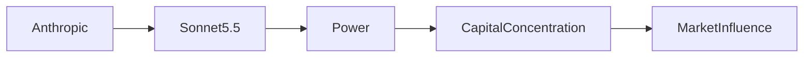

# Sonnet 5.5 y la Nueva Arquitectura del Poder de la IA

Anthropic’s latest release, Sonnet 5.5, es más que una mejora técnica; es una maniobra estratégica que remodela cómo fluye el valor a través del ecosistema de inteligencia artificial. Si bien el modelo muestra razonamiento mejorado, ventanas de contexto más largas y puntuaciones superiores en benchmarks, su lanzamiento ocurre en un momento de creciente escrutinio sobre la concentración en el sector de la IA. Este artículo analiza el movimiento desde la perspectiva de las relaciones de poder, la concentración de capital y la trayectoria histórica de la dominación de plataformas.

## Del laboratorio de investigación al poder del mercado

Fundada en 2021, Anthropic se posicionó como una alternativa “segura” a los gigantes del Valle del Silicio que dependen de datos. Las primeras inversiones de Amazon, Google y un consorcio de firmas de capital dieron a la startup una combinación rara de credibilidad técnica y músculo financiero. Para 2023, la valoración de Anthropic superó los 5 mil millones de dólares, lo que le permitió construir una pila vertical que abarca investigación de modelos, servicios en la nube y una puerta de enlace API propietaria. Sonnet 5.5 es el primer producto insignia que surge de esa estructura integrada, y sus datos de lanzamiento están diseñados para aprovechar el control de Anthropic sobre los pesos de los modelos, los canales de distribución downstream y la comunidad de desarrolladores que construye sobre sus APIs.

## La economía de los lanzamientos de modelos

La economía de lanzar un modelo de lenguaje a gran escala ha cambiado drásticamente desde los inicios del GPT‑2 de código abierto. Hoy, el costo de entrenar un solo modelo puede superar los 100 millones de dólares, con gastos adicionales para infraestructura de inferencia, ajuste fino y cumplimiento. Estas barreras de entrada hacen que solo unas pocas empresas puedan permitirse traer un nuevo modelo al mercado con regularidad. El modelo de negocio de Anthropic explota esta realidad al combinar el acceso al modelo con créditos de nube, licencias empresariales y una consola propietaria que fomenta el bloqueo. Por eso, Sonnet 5.5 se vende no solo como un modelo de IA autónomo, sino como una puerta de entrada a un conjunto de servicios que refuerzan las fuentes de ingresos de la compañía.

## Concentración de poder en la cadena de valor de la IA

## Paralelos históricos y dinámicas competitivas

La actual consolidación del sector de la IA recuerda el auge de las telecomunicaciones a principios de los 2000, cuando un reducido número de incumbentes controlaba la fibra óptica y dictaba precios. De manera similar, pocos proveedores de nube poseen la mayor parte de la capacidad computacional global, lo que les otorga la capacidad de modelar el costo de la inferencia de IA. El lanzamiento de Sonnet 5.5 está alineado estratégicamente con el intento de Anthropic de convertirse en un jugador de “capa‑2” que se sitúa sobre esta infraestructura, ofreciendo un producto diferenciado mientras sigue dependiendo de los recursos de computación subyacentes de Amazon Web Services (AWS). Esta dependencia crea una relación simbiótica pero precaria: Anthropic gana escala, pero AWS retiene el control último sobre el sustrato de computación. Esta situación plantea preguntas sobre la sostenibilidad y la independencia estratégica.

## Implicaciones para desarrolladores y usuarios finales

Para los desarrolladores, Sonnet 5.5 introduce nuevas capacidades que pueden reducir ciclos de desarrollo y mejorar el rendimiento de las aplicaciones. Sin embargo, la misma liberación también refuerza una tendencia hacia APIs propietarias que están estrechamente acopladas a proveedores específicos de nube. Esta tendencia genera preocupaciones sobre bloqueo de proveedor, soberanía de datos y la accesibilidad a largo plazo de estándares abiertos. Investigadores independientes han advertido que la creciente dependencia de puntos finales de modelos cerrados podría ahogar la innovación en nichos que carecen de los recursos para negociar contratos empresariales.

## Flujo de capital y señales del mercado

## Consideraciones antimonopolio y regulatorias

Los reguladores de Estados Unidos y la Unión Europea han comenzado a investigar la cadena de suministro de IA en busca de comportamientos anticompetitivos. La reciente investigación antimonopolio del Departamento de Justicia sobre los servicios de IA basados en la nube cita “prácticas excluyentes potenciales” que involucran asociaciones exclusivas entre proveedores de modelos y plataformas de nube. La integración estrecha de Sonnet 5.5 con AWS podría convertirse en un punto focal de estas investigaciones, especialmente si la asociación se considera que limita el acceso de rivales a recursos de computación comparables.

## Una evaluación crítica del impacto estratégico de Sonnet 5.5

En resumen, Sonnet 5.5 representa un momento pivotal en la evolución de la industria de la IA. Ilustra cómo un modelo técnicamente avanzado puede ser utilizado como activo estratégico para reforzar estructuras de poder existentes, concentrar capital y expandir la influencia de una empresa a lo largo de múltiples capas de la cadena de valor. Si bien el modelo ofrece mejoras tangibles para los usuarios finales, su lanzamiento también acelera la tendencia hacia ecosistemas de IA verticalmente integrados que son resistentes a la competencia y difíciles de interrumpir sin un respaldo financiero sustancial. Las implicaciones trascienden a Anthropic, dando forma al panorama competitivo de todos los jugadores que dependen de servicios de IA hospedados en la nube.

## Hacia el futuro

Los próximos años probablemente verán el lanzamiento de más modelos de IA bajo modelos de asociación similar, cada uno buscando bloquear a los desarrolladores en entornos de nube específicos. Los responsables de políticas, los vigilantes de la industria y los defensores del código abierto deberán diseñar mecanismos que preserven un campo de juego equitativo mientras siguen fomentando la innovación. Ya sea mediante la aplicación de la legislación antimonopolio, incentivos de licenciamiento de código abierto o el desarrollo de marcos de computación federada, el objetivo más amplio debe ser asegurar que los beneficios económicos de la IA no se monopolizen en unas pocas entidades bien financiadas.

---

*Palabras clave: inteligencia artificial, concentración del mercado de IA, Anthropic, Sonnet 5.5, computación en la nube, dinámicas de poder, flujo de capital, regulación de IA, alianzas estratégicas, análisis de la industria tecnológica*

