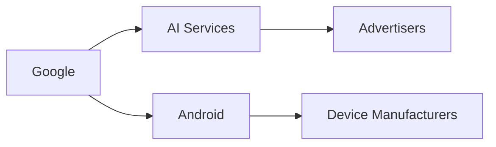

## Introducción  
En los últimos ocho años, la percepción pública de Google ha pasado de “el motor de búsqueda más útil” a “una corporación que parece jugar a ser todo a la vez”. La pregunta que plantea el artículo de HackerNews *When did Google get so weird?* no solo es anecdótica; revela tensiones estructurales en la industria tecnológica, donde el poder de una sola empresa se intersecta con la política de datos, la carrera por la Inteligencia Artificial (IA) y la lógica del mercado publicitario.

## Un gigante que se diversifica sin frenos  

Google, ahora bajo la sombrilla de Alphabet Inc., controla una cadena de valor que empieza en los usuarios finales (Búsqueda, Gmail, Maps) y termina en los anunciantes globales. Cada nuevo producto —Google Photos, Google Home, Waymo— no es un simple añadido, sino una extensión de su capacidad para recolectar datos y entrenar modelos de IA. Esta expansión vertical crea barreras de entrada imposibles para startups que no disponen de la enorme base de datos de usuarios a la que Google ya tiene acceso.

## Concentración de capital y efectos de red  
El poder de Google proviene esencialmente de dos fuentes de capital: financiero y de datos. Con una capitalización de mercado que supera los 1.5 billones de dólares, la empresa puede invertir miles de millones en centros de cómputo y en la adquisición de talento de IA. Pero el capital más valioso es el de los datos: cada búsqueda, cada foto subida, cada ruta de navegación alimentan algoritmos que mejoran la precisión de los anuncios. Este efecto de red hace que el coste marginal de adquirir un nuevo usuario sea prácticamente nulo, mientras que los competidores enfrentan altos costes de adquisición y retención.

## Competidores bajo presión: la respuesta de Microsoft y Apple  

## Historias pasadas de concentración  

## Riesgos regulatorios y la “gran hermano” digital  

## Impacto en los desarrolladores y la comunidad open source  
Google controla gran parte de la infraestructura open source que alimenta la IA: TensorFlow, Kubernetes y la suite de herramientas de desarrollo de Cloud. Si bien estos proyectos son técnicamente abiertos, la dependencia de los servicios de Google Cloud crea un **lock‑in** de facto. Los desarrolladores que intentan escapar descubren que las alternativas (por ejemplo, PyTorch en Azure) requieren migraciones costosas y pérdida de compatibilidad con funcionalidades propietarias como Vertex AI.

## Dinámicas económicos reales: ganancias de escala vs. externalidades negativas  
El modelo de Google genera economías de escala que reducen los costos de los consumidores (búsqueda gratuita, mapas, correo). No obstante, genera externalidades negativas: pérdida de privacidad, sesgos algorítmicos que refuerzan desigualdades y una consolidación del poder mediático que dificulta la pluralidad informativa. Estas externalidades son subvaloradas en los balances contables, pero se reflejan en debates éticos y en la presión de grupos de la sociedad civil.

## ¿Hacia dónde se dirige la industria?  
Si la tendencia continúa, la industria tecnológica podría fragmentarse en dos polos: gigantes de datos (Google, Meta, Amazon) y un conjunto de nichos especializados que compiten en áreas no dependientes de la información masiva, como hardware especializado, biotecnología y blockchain. La clave será la capacidad de los reguladores y de los consumidores para redefinir el valor del control de datos frente a la conveniencia de servicios “gratuitos”.

## Conclusión reflexiva  
Google se ha convertido en una entidad cuyo comportamiento parece “raro” porque está operando en un territorio donde la información es el recurso más escaso y, a la vez, el más abundante. La concentración de capital y datos no solo redefine el panorama competitivo, sino que plantea preguntas fundamentales sobre la soberanía digital, la privacidad y la distribución de poder en la sociedad del conocimiento. Como consumidores, desarrolladores y ciudadanos, debemos preguntarnos: ¿Queremos un futuro donde una sola compañía decida qué información es visible, qué anuncio es relevante y, en última instancia, qué decisiones tomamos?