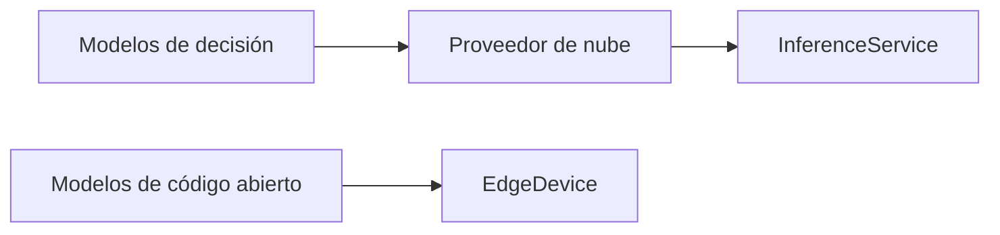

# El auge de los modelos de decisión de 0.8 B entrenados en el hogar y su desafío a las estructuras de poder de la IA en la nube

El panorama de la inteligencia artificial ha estado dominado durante mucho tiempo por un número reducido de proveedores de infraestructura en la nube—Google Cloud, Amazon Web Services y Microsoft Azure—que controlan tanto los enormes recursos de cómputo como los lucrativos mercados de inferencia como servicio. Sus ecosistemas bloquean a los clientes en pilas propietarias, creando una concentración de capital que limita la competencia genuina. En este contexto, un modesto avance de la comunidad de código abierto—entrenar un modelo de decisión de 0.8 billion de parámetros completamente en una estación de trabajo de consumo—ha despertado un nuevo debate sobre quién realmente posee el futuro de la inferencia de IA.

## Por qué el tamaño sigue importando, pero no lo es todo

Históricamente, la industria ha equiparado el tamaño del modelo con su capacidad. Desde los primeros avances como BERT y GPT‑2 hasta los transformadores masivos que superan un billón de parámetros, los modelos más grandes prometen representaciones más ricas y mayor precisión. Sin embargo, la incansable búsqueda de escala ha producido un paradoja: el costo de entrenar y servir estos gigantes es prohibitivo para todas menos las empresas más ricas. Entrenar un modelo de 175 billion de parámetros puede requerir miles de días de GPU, mientras que la inferencia diaria de dicho modelo puede consumir megavatios de electricidad. Las implicaciones económicas son claras: solo las corporaciones con profundos recursos pueden sostener este ciclo.

Las técnicas de **compresión de modelos**—quantización, poda, distilación de conocimiento—han comenzado a socavar este monopolio. Empresas como Meta han publicado versiones altamente distiladas de los modelos Llama, y startups están experimentando con variantes de 7 billion de parámetros que pueden ejecutarse en una sola GPU. Sin embargo, el verdadero disruptor llega cuando un modelo puede ser entrenado en un ordenador personal, eliminando la necesidad de clústers de entrenamiento basados en la nube.

## Jeff: Un caso de estudio en entrenamiento de modelos en el hogar

El proyecto de GitHub *jeff* de firelex muestra un modelo de decisión de 0.8 billion de parámetros que puede entrenarse en una PC doméstica en menos de una hora. El README del repositorio resalta una cadena de entrenamiento que aprovecha hardware de bajo costo, bibliotecas de código abierto y pipelines de datos eficaces. Crucialmente, el modelo alcanza una latencia de inferencia de aproximadamente **30 ms** por solicitud, una velocidad comparable a muchas APIs de inferencia comerciales cuando se sirven en una GPU modesta.

Lo que hace a *jeff* emblemático de un cambio más amplio no es solo el logro técnico, sino la **implicación económica**: toda la vida útil del modelo—desde la recolección de datos hasta el entrenamiento y la implementación—encaja dentro del presupuesto de un desarrollador individual o de un pequeño estudio. Esto contrasta marcadamente con el modelo tradicional, donde los presupuestos de entrenamiento se miden en miles de millones de dólares y están respaldados por capital de riesgo corporativo.

## Relaciones de poder en la cadena de suministro de IA

Las dinámicas de poder en la IA pueden visualizarse como un triángulo:

1. **Proveedores de nube** – Amazon, Google y Microsoft poseen la espina dorsal de los recursos de cómputo globales, ofreciendo APIs que prometen escalabilidad, fiabilidad y servicios gestionados. Su dominio les otorga ventaja sobre tanto desarrolladores de modelos como usuarios finales.
2. **Creadores de modelos** – Laboratorios grandes (DeepMind, OpenAI, Anthropic) impulsan los límites de la capacidad, pero siguen dependiendo de la nube para entrenar e inferir a gran escala.
3. **Practicionadores perimetrales** – Desarrolladores individuales, startups e investigadores que ejecutan modelos localmente, a menudo en hardware de consumo, disfrutan de menor latencia y beneficios de privacidad de datos, pero carecen del respaldo de infraestructuras masivas.

Cuando un modelo de entrenamiento doméstico como *jeff* alcanza un rendimiento comparable al de producción, difumina las líneas entre estas capas. La **relación** se convierte en un bucle de retroalimentación: los practicantes perimetrales pueden exigir inferencia más barata y rápida, obligando a los proveedores de nube a ofrecer tarifas más competitivas. Simultáneamente, los gigantes de la nube pueden responder integrando modelos de código abierto en sus servicios, adquiriendo así talento y tecnología mientras mantienen su monopolio sobre el hardware subyacente.

## Ecos resonantes de la historia: de los mainframes a los microcomputadores

El cambio no es solo tecnológico; también es **cultural**. Las comunidades alrededor de plataformas como GitHub, Hugging Face y ArXiv han fomentado una ética colaborativa que valora la difusión y la reproducibilidad. Esta cultura ya ha producido modelos influyentes como Llama, Falcon y Mistral, que están disponibles gratuitamente para fine‑tuning. Cuando estos modelos pueden desplegarse en un portátil, la **barriera de entrada** colapsa, empoderando a una mayor variedad de innovadores.

## Realidades económicas de la IA perimetral

Desde el punto de vista económico, la estructura de costos de la inferencia perimetral es fundamentalmente diferente a la de la inferencia en la nube. Los proveedores de nube cobran por volumen de solicitudes, latencia y asignación de recursos, a menudo agrupando estos cargos con almacenamiento, redes y servicios de monitoreo. La IA perimetral, por el contrario, incurre en un **gasto de capital único**—la compra de una GPU o ASIC—y luego ofrece un costo marginal prácticamente nulo por cada inferencia. Este modelo se alinea con el concepto de **eficiencia de recursos**, un argumento clave para organizaciones que buscan reducir gastos operativos.

Además, el despliegue perimetral evita inquietudes regulatorias y de privacidad asociadas al envío de datos sensibles a servidores de terceros. Para sectores como la salud, las finanzas y los vehículos autónomos, mantener los datos en el dispositivo no es solo una preferencia técnica, sino una necesidad legal. La capacidad de ejecutar un modelo de decisión local, por tanto, posee un **valor estratégico** que trasciende el rendimiento puro.

## La amenaza competitiva para la IA en la nube

La aparición de modelos de decisión de 0.8 B entrenados en el hogar plantea varios desafíos concretos para los servicios de IA en la nube:

- **Presión de precios**: si un segmento significativo de empresas puede satisfacer sus necesidades de inferencia con una GPU de 2 000 USD, la demanda de APIs de nube de alto costo podría estancarse o disminuir.
- **Saturación de funciones**: las plataformas de nube se diferencian mediante servicios gestionados—auto‑escalado, monitoreo avanzado e integraciones. Los modelos perimetrales carecen actualmente de estas capas de valor añadido, lo que lleva a los proveedores de nube a **invertir** en soluciones híbridas que incorporen ejecutables de código abierto.
- **Migración de talento**: ingenieros capaces de entrenar e implementar modelos en hardware personal pueden inclinarse hacia startups o proyectos de código abierto, diluyendo el pool de talento disponible para las hyperscalers.

## Implicaciones para la política y la regulación

Desde la perspectiva de la política, los gobiernos podrían considerar incentivos—como créditos fiscales para iniciativas de **IA verde**—para fomentar la adopción de inferencia energéticamente eficiente en el perímetro. Tales medidas podrían acelerar la transición lejos de los cada vez más enormes centros de datos, alineando el progreso tecnológico con los objetivos climáticos.

## Futuras escenarios: coexistencia o consolidación?

Dos plausibles futuros emergen de la trayectoria actual:

1. **Co‑existencia**: Los proveedores de nube continúan dominando cargas de trabajo de inferencia de alto rendimiento y distribuido a nivel global, mientras apoyan un ecosistema de modelos perimetrales. Arquitecturas híbridas podrían ver a las plataformas de nube ofreciendo **mercados de modelos** donde los desarrolladores alquilen o compren kernels de inferencia optimizados que se ejecuten localmente.
2. **Consolidación**: Un número reducido de corporaciones adquiere los proyectos de código abierto más prometedores, integrándolos en sus pilas propietarias. Esto preservaría su control sobre el hardware subyacente mientras aprovechaba la innovación comunitaria para mantenerse competitivas.

El caso de estudio de *jeff* ilustra que el **equilibrio de poder** sigue siendo fluido. Al democratizar la capacidad de entrenar y servir modelos de decisión en el hogar, el proyecto siembra una semilla que podría desarrollar una economía de IA más distribuida y resiliente.

## Conclusión: Un llamado a la reflexión activa

El auge de los modelos de decisión de 0.8 billion de parámetros entrenados en el hogar es más que una curiosidad técnica; es un catalizador para replantear quién ostenta las riendas del progreso de la IA. A medida que estos modelos demuestran su eficacia en latencia, costo y privacidad, desafían las jerarquías arraigadas de la IA en la nube. Las partes interesadas—desde desarrolladores individuales hasta corporaciones multinacionales—deben enfrentar las dinámicas cambiantes de poder, capital y responsabilidad.

Para los lectores que desean mantenerse a la vanguardia, la lección es clara: monitoren las herramientas que les permiten construir, entrenar e implementar IA localmente. Experimenten con alternativas de código abierto, aboguen por precios transparentes y consideren cómo sus elecciones moldean el panorama industrial más amplio. Al hacerlo, se convierten en participantes activos en decidir si la IA permanece como una utilidad centralizada o evoluciona hacia una fuerza verdaderamente descentralizada de innovación.

