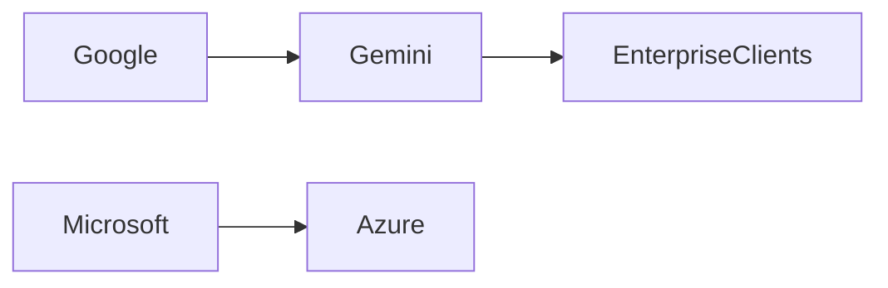

## Introducción

El reciente anuncio de **Gemini 4 Argon** por parte de Google ha generado un debate que trasciende la mera innovación tecnológica. Más allá de los avances técnicos, la noticia abre una ventana a cómo el poder en la industria de la IA se redistribuye entre unas cuantas corporaciones que controlan tanto el capital como la infraestructura esencial. Este artículo analiza la noticia desde una perspectiva crítica, conectando tendencias históricas con la concentración actual de recursos y mostrando por qué la estrategia de Google podría marcar un punto de inflexión en la competencia global.

## ¿Qué es Gemini 4 Argon?

Gemini 4 Argon es la última iteración de la familia de modelos de lenguaje de Google, diseñada para combinar **razonamiento multimodal** con una arquitectura optimizada para inferencia en tiempo real. Según la documentación oficial, el modelo introduce mejoras en:

- **Eficiencia energética**: reduce el consumo de GPU en un 30 % respecto a versiones anteriores.
- **Capacidad de contexto**: permite procesar hasta 200 000 tokens en una sola pasada.
- **Integración con Google Cloud**: despliegue sin fisuras en Vertex AI y en la plataforma de datos de BigQuery.

Estas características no solo posicionan a Gemini 4 Argon como un competidor directo de los modelos de OpenAI, Meta y Anthropic, sino que también refuerzan la estrategia de Google de **verticalizar** su oferta de IA, desde el hardware (TPU) hasta los servicios en la nube.

## El contexto de la competencia

| Empresa | Producto clave | Infraestructura propia |
|--------|----------------|------------------------|
| **Google** | Gemini 4 Argon | TPU v5, Google Cloud, TensorFlow |
| **Microsoft** | Azure OpenAI Service | Supercomputadora Azure, modelos GPT‑4 |
| **Amazon** | Bedrock + Titan | Inferentia, Graviton, AWS |
| **Meta** | LLaMA 3 | PyTorch, Meta AI Infra |
| **OpenAI** | GPT‑4‑Turbo | Azure (socio), API de pago |

Esta tabla muestra cómo la **concentración de capital** se traduce en una competencia donde el factor diferenciador no es solo la calidad del modelo, sino la capacidad de sustener gastos de investigación y desarrollo que superan los **mil millones de dólares al año**. Solo las grandes tecnológicas pueden permitirse estas inversiones, lo que genera una barrera de entrada formidable para startups y universidades.

## Dinámicas de poder y relaciones de dependencia

1. **Developers** → **Gemini API** → **Google Cloud Billing**  
   Los desarrolladores que adoptan la API de Gemini deben pagar por el uso a través de la facturación de Google Cloud, creando una fuente de ingresos recurrente.

2. **Enterprise Clients** → **Gemini‑powered Solutions** → **Servicios de datos** (BigQuery, Cloud Storage)  
   Empresas que integran Gemini en sus flujos de trabajo dependen de los servicios de datos de Google, lo que refuerza la retención de clientes.

3. **Reguladores** → **Auditorías de uso** → **Google Compliance**  
   La transparencia en el entrenamiento de modelos se vuelve un tema regulatorio; al mantener la mayor parte del proceso interno, Google ejerce mayor control sobre la información que se procesa.

Estas relaciones evidencian una **estructura de poder** donde Google no solo vende un modelo, sino que vende una **plataforma integrada** que bloquea la migración a competidores.

## Conexión con tendencias históricas

La aparición de Gemini 4 Argon se inscribe en una larga serie de **ciclos de consolidación** en la industria tecnológica:

- **Era mainframe (1950‑1970)**: IBM dominaba el hardware y el software, imponiendo estándares que moldeaban el mercado.
- **Revolución personal (1980‑1990)**: Microsoft y Apple competían por la plataforma operativa, pero la apertura de Windows permitió una mayor diversificación.
- **Boom de Internet (1990‑2000)**: Google lideró la búsqueda y la publicidad digital, mientras Amazon revolucionó el comercio electrónico mediante la infraestructura de servidores.
- **Nube y SaaS (2000‑2015)**: AWS, Azure y Google Cloud ofrecieron servicios bajo demanda, consolidando la dependencia de la infraestructura en la nube.
- **Inteligencia Artificial (2015‑presente)**: La necesidad de **compute massivo** y **datos** ha llevado a que solo unas pocas corporaciones puedan entrenar modelos de última generación.

En cada una de estas fases, la **concentración de capital** ha permitido a unas pocas empresas definir normas, precios y estándares de interoperabilidad. Gemini 4 Argon representa el último eslabón de este patrón: una solución que aprovecha la infraestructura de Google (TPU, redes de fibra, centros de datos) para ofrecer un modelo que, a su vez, refuerza la mochila financiera de la compañía.

## Implicaciones económicas y de mercado

### 1. **Efectos de red**

Al lanzar Gemini 4 Argon, Google busca **ganar cuota de mercado** en el segmento de modelos de IA pagados. La disponibilidad de un modelo de alto rendimiento a precios competitivos puede forzar a los clientes a migrar desde Azure o AWS, creando **efectos de red** que aumenten la base de usuarios de Google Cloud.

### 2. **Presión sobre precios**

La estrategia de precios de Gemini — una combinación de **tarifa por token** y **descuentos por uso a gran escala** — presiona a la competencia a reducir sus costos. Esto puede desencadenar una **guerra de precios** que beneficie a los clientes, pero que también pueda limitar la rentabilidad de startups que dependen de modelos más especializados.

### 3. **Riesgo de monopolio**

Si Gemini se convierte en el estándar de facto para aplicaciones empresariales, el **poder de negociación** de Google se ampliará más allá del software, extendiéndose a la **normatividad** de la industria. Un dominio tan amplio puede dificultar la entrada de soluciones abiertas, limitando la diversificación tecnológica.

## Perspectivas futuras

El futuro de la IA dependerá de cómo se equilibren **innovación**, **competencia** y **regulación**. Algunos escenarios posibles:

- **Coopetencia**: Empresas como Microsoft y Amazon podrían lanzar sus propias versiones de Gemini, creando una **guerra de ecosistemas** donde la interoperabilidad sea limitada.
- **Regulación antimonopolio**: Los organismos regulatorios podrían exigir **interoperabilidad forzada** entre modelos de diferentes proveedores, reduciendo la capacidad de bloqueo de Google.
- **Open‑source como contrapeso**: Proyectos como Llama 3 o Mistral podrían ganar terreno si logran combinar **calidad** con **accesibilidad**, desafiando la hegemonía de los modelos propietarios.

En cualquier caso, la evolución de Gemini 4 Argon subraya la importancia de **analizar la arquitectura de poder** detrás de la tecnología. No basta con examinar código o benchmarks; es necesario entender cómo la **concentración de capital** y las **relaciones de dependencia** moldean el ecosistema de IA.

## Conclusión

Gemini 4 Argon representa más que un salto técnico; es un punto de inflexión que revela cómo los **gigantes tecnológicos** utilizan la IA para reforzar su dominio económico. Al combinar modelos de alta performance con una infraestructura de nube verticalmente integrada, Google está ampliando su **poder de mercado** y, al mismo tiempo, creando nuevas barreras de entrada para la competencia. La historia tecnológica nos muestra que estos ciclos de consolidación son inevitables, pero también que la regulación y la innovación abierta pueden actuar como contrapesos. La reflexión final, entonces, es clara: ¿hasta qué punto estamos dispuestos a aceptar una arquitectura de poder que, aunque eficiente, pueda limitar la diversidad y la competencia que han impulsado la innovación durante décadas? La respuesta decidirá el rumbo de la próxima era de la inteligencia artificial.

