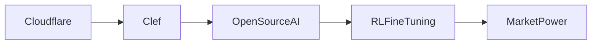

# Modelos de Decisión de IA de Código Abierto: El Desafío de Clef a los Titanes de la Nube

El reciente anuncio de **Clef**, el marco de modelado de decisiones de código abierto de Cloudflare acompañado de una plataforma de afinado por aprendizaje por refuerzo (RL), ha generado un debate vigoroso en la prensa tecnológica y entre las comunidades de desarrolladores. Mientras la publicación del blog presentaba la iniciativa como un paso hacia una IA "más transparente y gobernada por la comunidad", una inspección más profunda revela una maniobra estratégica que podría remodelar las dinámicas de poder entre las pocas empresas que actualmente dominan la investigación y el despliegue de IA.

## Breve historia del ascenso de Cloudflare

Fundada en 2009, Cloudflare comenzó como una modesta red de entrega de contenido (CDN) destinada a acelerar el tráfico web. En la última década, la compañía se ha expandido hasta convertirse en una extensa plataforma de computación en el borde que ahora compite con los titanes de la nube Amazon Web Services (AWS), Microsoft Azure y Google Cloud. Su red abarca más de 200 ciudades, manejando aproximadamente el 25 % del tráfico web global. Esta escala le brinda a Cloudflare una visibilidad sin precedentes del comportamiento de Internet, proporcionándole datos sobre patrones de tráfico, amenazas de seguridad y demografía de usuarios que pocos competidores pueden igualar.

## Modelos de Decisión de Código Abierto: ¿Una nueva capa de gobernanza?

Los flujos de IA tradicionales suelen depender de modelos "caja negra" cuya lógica interna es opaca. Empresas como Google, Meta y Amazon tratan los pesos de los modelos y las APIs de inferencia como secretos comerciales, limitando la auditoría externa y obligando a los usuarios a confiar en garantías de seguridad emitidas por el proveedor. Los **modelos de decisión**, tal como se describen en la documentación de Clef, buscan exponer el razonamiento detrás de las predicciones al mapear características de entrada a resultados de política discretos. En la práctica, esto significa que los desarrolladores pueden incrustar reglas como "si la edad del usuario < 13, bloquear la segmentación publicitaria" directamente en el camino de inferencia.

El código abierto de este marco democratiza el acceso a herramientas de gobernanza que antes estaban reservadas a unos pocos laboratorios de investigación bien financiados. También crea una nueva arena de competencia: cualquier organización que pueda bifurcar Clef, adaptarlo a casos de uso nicho e integrarlo con sus propios datos puede reclamar una parte de la pila de toma de decisiones. Este desarrollo se alinea con el ethos del código abierto de "código transparente, compilaciones reproducibles", pero también plantea preguntas sobre la sostenibilidad. ¿Quién financia el mantenimiento de un proyecto que se sitúa en la intersección de una infraestructura informática masiva y el cumplimiento regulatorio?

## Afinado por Aprendizaje por Refuerzo: Democratizando la alineación

La plataforma de afinado por RL que acompaña a Clef añade otra capa de ambición. El aprendizaje por refuerzo a partir de retroalimentación humana (RLHF) se ha convertido en el estándar de la industria para alinear grandes modelos de lenguaje (LLM) con las expectativas de los usuarios. Históricamente, las canalizaciones RLHF han estado bloqueadas detrás de APIs propietarias, requiriendo recursos computacionales extensos y experiencia especializada. Al ofrecer un **servicio gratuito y modular de afinado por RL**, Cloudflare reduce la barrera de entrada para pequeñas empresas e investigadores independientes.

Desde una perspectiva económica, esto podría difundir la concentración de talento de alineación que actualmente reside en unos pocos laboratorios corporativos. Sin embargo, las decisiones de diseño de la plataforma —como los modelos de recompensa por defecto y la cola de trabajos de cómputo— siguen dependiendo de la infraestructura subyacente de Cloudflare. Como resultado, aunque el servicio sea técnicamente de código abierto, su gobernanza práctica permanece entrelazada con las prioridades operativas de Cloudflare.

## Relaciones de poder en un mercado consolidado

El ecosistema de IA se ha caracterizado históricamente por efectos de red: los datos generan mejores modelos, que a su vez atraen más datos. Este ciclo virtuoso ha permitido a unas pocas empresas acumular una influencia desproporcionada. DeepMind de Google, la asociación de Microsoft con OpenAI, Bedrock de Amazon y la serie Llama de Meta controlan vastas porciones de distribución de modelos, cómputo en la nube y canales de talento. La concentración de capital es evidente en los miles de millones de dólares invertidos en startups de IA respaldadas por venture capital que, al final, son adquiridas o integradas en estos incumbentes.

El lanzamiento de Clef puede interpretarse tanto como un movimiento defensivo como ofensivo. Defensivamente, refuerza la posición de Cloudflare como un "middleware neutral" que puede incrustar la aplicación de políticas en múltiples entornos de nube. Ofensivamente, al ofrecer una alternativa de código abierto a las pilas de decisión propietarias, Cloudflare puede buscar capturar una porción de la cadena de valor que tradicionalmente fluye hacia los mayores proveedores de modelos. El cálculo estratégico refleja batallas de plataformas anteriores —como las guerras de navegadores de los años 90— donde el control sobre la interfaz dio forma a la economía de la innovación descendente.

## Paralelos históricos: De las guerras de sistemas operativos a la gobernanza de IA

El panorama actual de IA guarda similitudes con las guerras de sistemas operativos (OS) de finales del siglo XX. El dominio de Microsoft con Windows se habilitó mediante un ecosistema de aplicaciones de terceros que dependían de sus APIs. Cuando Linux emergió como alternativa de código abierto, gradualmente captó la atención de los desarrolladores, obligando a Microsoft a adaptarse con Azure y adoptar modelos híbridos de nube. En el ámbito de IA, marcos de código abierto como TensorFlow, PyTorch y ahora Clef actúan como el "núcleo Linux" de la gobernanza del aprendizaje automático.

Sin embargo, a diferencia de los mercados de OS donde la interoperabilidad era mayormente una elección técnica, la gobernanza de IA implica apuestas económicas y regulatorias profundas. La capacidad de aplicar políticas en tiempo de inferencia se traduce directamente en costos de cumplimiento para las empresas, potenciales responsabilidades por resultados nocivos e incluso implicaciones geopolíticas. Por consiguiente, la batalla por quién escribe el libro de reglas del comportamiento de la IA no es meramente técnica; es una contienda por capital, participación de mercado y confianza pública.

## Realidades económicas: Financiamiento, tokenización y captura

Desde el punto de vista económico, la sostenibilidad de los proyectos de IA de código abierto depende de modelos de financiación que equilibren altruismo y generación de ingresos. El plan de negocio de Cloudflare tradicionalmente se basa en una capa freemium para sus servicios centrales, monetizando características premium de seguridad y rendimiento. Extender este modelo a la gobernanza de IA permite a la empresa monetizar **el acceso a clusters de alta capacidad para afinado por RL** mientras mantiene el código base libremente disponible. Este enfoque refleja cómo Red Hat monetizó Linux de código abierto mediante soporte empresarial.

No obstante, la "tokenización" de la gobernanza —dividir la aplicación de políticas en llamadas API discretas y consumibles— crea incentivos para la captura. Grandes empresas podrían negociar precios preferenciales para mayores cuotas, comprando efectivamente influencia sobre los heurísticos de decisión que guían las salidas del modelo. Además, a medida que más organizaciones adopten canalizaciones derivadas de Clef, los efectos de red podrían volver a concentrar el poder en manos de unos pocos proveedores de nube capaces de costear la infraestructura más robusta para escalar el afinado por RL.

## El papel de la regulación y la supervisión comunitaria

Los gobiernos de todo el mundo están comenzando a proponer regulaciones que exijan transparencia, responsabilidad y auditabilidad de los sistemas de IA. El AI Act de la Unión Europea, por ejemplo, clasifica aplicaciones de IA de alto riesgo y demanda una documentación rigurosa de datos de entrenamiento, procedencia del modelo y estrategias de mitigación. Los modelos de decisión de código abierto como Clef podrían servir como bloques de construcción para canalizaciones de IA compatibles, pero solo si incorporan mecanismos para la verificación externa.

## Conclusión: Reflexiones sobre el futuro de las estructuras de poder en IA

Los modelos de decisión de código abierto y la plataforma de afinado por RL de Clef representan un momento pivotal en la evolución de la industria de IA. Señalan la tensión entre el potencial democratizador del código compartido y los incentivos arraigados de los incumbentes de capital intensivo que buscan moldear las reglas del comportamiento de la IA. A medida que el ecosistema madura, la cuestión ya no es si el código abierto jugará un rol en la gobernanza de IA, sino cómo se estructurará ese rol, quién lo financiará y si realmente puede resistir la captura por parte de las empresas que anteriormente custodiaban modelos propietarios.
