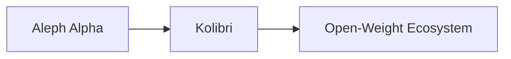

# Kolibri’s Open‑Weight Sovereign Model Challenges AI Power Concentration

The release of **Kolibri**, Aleph Alpha’s “sovereign open‑weight” large language model, is more than a technical milestone; it is a strategic maneuver that forces a reevaluation of how power, capital, and expertise are distributed across the **AI industry**. While headlines celebrate the arrival of a freely downloadable, fully‑parameterized model, the deeper narrative unfolds in the boardrooms of venture capitalists, the lobbying corridors of government agencies, and the tightly‑controlled ecosystems of the biggest tech firms.

## A New Sovereign Player Enters the Field

Aleph Alpha, a German start‑up that emerged from the European AI scene, has positioned Kolibri as a counterweight to the hyper‑centralized model of **Big Tech**. By issuing the model under an open‑weight license, the company grants researchers, developers, and even hobbyists the ability to fine‑tune, redistribute, and commercially exploit the model without the typical restrictions imposed by proprietary clouds. This move directly challenges the **capital concentration** that has long allowed a handful of U.S. and Chinese conglomerates—Google, Microsoft, Meta, and Baidu—to dictate the pace of AI development.

The term “sovereign” is not merely rhetorical. In geopolitical discourse, “sovereign AI” refers to the ability of a nation or entity to control its own data, compute resources, and algorithmic infrastructure without reliance on external parties. Kolibri’s open‑weight nature provides a tangible pathway for European states and enterprises to build **AI sovereignty** capabilities, reducing dependence on U.S. cloud providers and mitigating the risk of tech‑related sanctions.

## Historical Echoes: From Open‑Source OS Wars to AI

The dynamics surrounding Kolibri echo the battles of the 1990s and early 2000s when **Linux** challenged proprietary operating systems dominated by Microsoft. At that time, a community‑driven, open-source kernel attracted contributions from a global pool of engineers, ultimately forcing Microsoft to adapt its business model, embrace open source, and even acquire GitHub. The **open-source AI** wave may follow a similar trajectory, but with a crucial twist: the stakes are higher because AI models are now integral to national security, economic competitiveness, and social control.

The **power concentration** in AI today mirrors the vertically integrated structures of early telecommunications and oil monopolies. Just as Standard Oil controlled refining, transportation, and distribution, today's AI giants control model training data, massive compute clusters, and the downstream applications that monetize those models. Kolibri’s open‑weight release threatens to fracture this monolith by providing a **self‑contained** model that can be run on modest hardware, thereby lowering the barrier to entry for startups, academia, and even small‑scale enterprises in emerging markets.

## Capital Concentration and the Economics of Model Distribution

The economics of AI development are heavily front‑loaded. Training a state‑of‑the‑art language model can cost hundreds of millions of dollars in GPU clusters, data acquisition, and engineering talent. This financial reality empowers a handful of well‑funded players who can afford the upfront investment. Venture capital firms have poured billions into AI startups, often in exchange for **equity stakes** that translate into board seats and influence over product roadmaps. 

When a company like Aleph Alpha releases an open‑weight model, it disrupts this capital‑intensive paradigm. The immediate financial return may be modest—revenues come from consultancy, custom fine‑tuning, or premium support—but the strategic payoff is significant. By building a reputation for technical excellence and open collaboration, Aleph Alpha can attract talent, forge partnerships with European research institutions, and position itself as a **neutral** player in a field dominated by U.S. and Chinese giants. This could shift the balance of **venture capital** flows toward European AI ventures, reshaping the global distribution of AI expertise and influence.

## Interlocking Relationships: Companies, Governments, and Regulators

Kolibri’s launch also illuminates the intricate network of relationships between **technology firms**, **national governments**, and **regulatory bodies**. In the European Union, the AI Act is poised to impose strict requirements on high‑risk AI systems, emphasizing transparency, accountability, and human oversight. A sovereign open‑weight model can be adapted to meet these standards more readily than a black‑box proprietary system, giving regulators a tool to enforce compliance without forcing companies to relinquish proprietary control.

Conversely, the United States has historically favored a more permissive approach, encouraging private-sector innovation while maintaining limited federal oversight. The emergence of an **open‑weight sovereign model** could pressure U.S. policymakers to reconsider this stance, especially as nations vie for leadership in AI standard‑setting bodies such as the OECD AI Policy Observatory. The competition is no longer just about who builds the biggest model; it is about who can claim the mantle of **technological sovereignty** and shape the normative framework that will govern AI for decades.

## The Ripple Effect on Downstream Markets

However, this democratization also raises concerns about **quality control** and **misuse**. Open‑weight models can be repurposed for illicit activities, from generating deep‑fakes to automating disinformation campaigns. The same openness that empowers benign innovation also requires robust governance mechanisms. Companies like Aleph Alpha may need to invest in model‑level guardrails, usage‑policy enforcement, and community policing to mitigate these risks, thereby adding another layer of complexity to the **power dynamics** at play.

## Implications for the Future of AI Development

1. **Hybrid Business Models** – Companies will increasingly blend open‑source offerings with premium services, leveraging community contributions while monetizing support, consulting, and specialized fine‑tuning. This mirrors the “open‑core” model that has become standard in database and DevOps tools.

2. **Geopolitical Decoupling** – Nations will seek to cultivate **AI sovereignty** through domestic model development and open‑weight ecosystems, reducing reliance on foreign cloud infrastructure. This could lead to a bifurcated global AI market, with distinct standards and regulatory regimes.

3. **Capital Redistribution** – Venture capital may shift towards projects that promise strategic autonomy rather than pure commercial scalability, fostering a new wave of AI startups focused on open‑weight models, edge deployment, and privacy‑preserving techniques.

In this evolving landscape, the traditional **vertical integration** strategies of major tech firms—owning data, compute, and applications—may give way to more modular, ecosystem‑driven approaches. The success of Kolibri will depend not only on technical excellence but also on the ability to navigate **power relations**, negotiate **regulatory environments**, and foster a **sustainable open‑source community**.

## Conclusion

Kolibri’s open‑weight sovereign model is more than a technical release; it is a calculated move that challenges the entrenched **power concentration** in the AI sector, reshapes **capital flows**, and offers a tangible pathway toward **AI sovereignty** for nations and organizations seeking independence from dominant tech conglomerates. As the industry watches closely, the next steps—how governments respond, how competitors adapt, and how the open‑source community engages—will determine whether this challenge merely scratches the surface or triggers a deep‑rooted transformation of the AI ecosystem. The reflection it invites is simple yet profound: Who truly controls the future of intelligence, and on whose terms will that control be exercised? 

    A[Aleph Alpha] --> B[Kolibri] --> C[Open‑Weight Ecosystem]