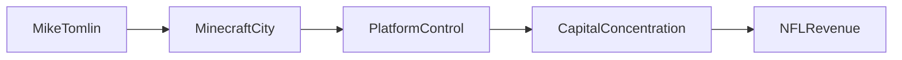

# Una Ciudad Digital Construida Ladrillo a Ladrillo  

Durante doce temporadas, el entrenador jefe de los Pittsburgh Steelers, Mike Tomlin, ha estado construyendo silenciosamente una vasta metrópolis de Minecraft dentro de su servidor privado. Lo que comenzó como un modesto terreno de entrenamiento para estrategias de juego evolucionó hasta convertirse en un entorno urbano completamente realizado, poblado por miles de estructuras construidas por jugadores, estadios personalizados y economías interactivas. La ciudad, ahora conocida entre la comunidad como “Tomlinville”, se ha convertido en un estudio de caso sobre cómo los creadores individuales pueden ejercer una influencia sustancial dentro de una plataforma controlada corporativamente.  

## De hobby a microcosmos económico  

La participación de Tomlin comenzó como un proyecto personal durante el tiempo de inactividad de la temporada baja. Reclutó a exjugadores, miembros del cuerpo técnico e incluso fans para que contribuyeran con diseños, convirtiendo el mundo virtual en un taller colaborativo. Con el tiempo, la ciudad generó su propia micro‑economía: los jugadores intercambiaban recursos, compraban skins personalizados y encargaban construcciones pagadas. Mientras que los flujos de ingresos son modestos en comparación con los e‑sports principales, la arquitectura de escasez y creación de valor refleja tendencias más amplias en la industria tecnológica.  

## Control de la Plataforma y Concentración de Capital  

En el centro de esta historia se encuentra la dinámica de poder entre Tomlin y la empresa matriz de Minecraft, Microsoft (a través de su adquisición de Mojang Studios). La propiedad de Microsoft del engine subyacente, el marketplace y los canales de distribución coloca a los dueños de la plataforma en la cima de una pirámide de control. La ciudad de Tomlin ilustra una idea clave: **incluso los creadores de alto perfil dependen de un único custodio corporativo para ancho de banda, monetización y aplicación de políticas**.  

Este dependencia refleja patrones históricos vistos en servicios en línea tempranos como el imperio arcade interminable de Atari o el auge de los juegos de “farm” de Facebook. En cada caso, una plataforma dominante dictaba los términos de participación, cosechaba datos de usuarios y extraía una parte del valor creado por los participantes externos. La diferencia hoy es la escala y sofisticación de los pipelines de datos que capturan el comportamiento del usuario, alimentándolos de regreso a la refinación del producto y la publicidad segmentada.  

## Implicaciones en el Mundo Real para la NFL y la Tecnología  

El uso de Minecraft por parte de Tomlin no es solo un pasatiempo; sirve como un terreno de entrenamiento para el pensamiento estratégico y el análisis de datos. La ciudad incorpora paneles de estadísticas personalizados que rastrean métricas de rendimiento de los jugadores, simulan formaciones rivales y visualizan los resultados de las jugadas en tres dimensiones. Estas herramientas son reminiscentes de las plataformas analíticas empleadas por los equipos de la NBA y las oficinas dirigidas de la MLB, que combinan ciencia del deporte con desarrollo de software.  

## Dinámicas Económicas del Contenido Generado por Usuarios  

El entorno de Minecraft que Tomlin cultivó demuestra la economía del contenido generado por usuarios (CGU). En un modelo típico de CGU, los creadores suministran la mayor parte del contenido mientras la plataforma captura una porción del beneficio financiero mediante tarifas de transacción, niveles de suscripción o mercados premium. El “Marketplace de Minecraft” de Microsoft ejemplifica esta estructura, ofreciendo a los creadores una participación en los ingresos que a menudo es menos favorable que los contratos de empleo tradicionales.  

Desde un punto de vista económico, este arreglo refuerza la **concentración de capital**: una pequeña fracción de creadores de alto ingreso puede sostenerse, mientras que la mayoría recibe retornes marginales. Esta asimetría refleja tendencias más amplias en el mercado laboral donde unas pocas empresas tecnológicas dominan roles de alta habilidad y alto pago, y el resto enfrenta precariedad del trabajo gig.  

## Relaciones de Poder y Paralelos Históricos  

La ciudad de Tomlin es un micro‑ejemplo de cómo el poder puede ejercerse y a la vez estar limitado. Por un lado, el entrenador comanda a una comunidad leal, define prioridades de desarrollo e influye en la dirección de proyectos dentro del juego. Por otro lado, debe navegar políticas de la plataforma que pueden cambiar de un día para otro, como actualizaciones de los acuerdos de licencia o cambios en los algoritmos del marketplace.  

Historicamente, estas desbalances de poder han impulsado la formación de coaliciones de creadores y plataformas alternativas. Principios de los años 2000 vieron el auge de motores de juego independientes como Unity y Godot cuando los creadores buscaban modelos de propiedad más equitativos. De manera similar, los desarrolladores indie actuales exploran alternativas descentralizadas basadas en tecnología blockchain, con el objetivo de reducir la dependencia de intermediarios centralizados.  

## Reflexiones sobre el Futuro de las Economías de Plataformas  

La narrativa de la metrópolis de Minecraft de 12 años de Mike Tomlin nos invita a reflexionar sobre cómo se gobiernan, monetizan y contestan los espacios digitales. A medida que las herramientas de contenido impulsadas por IA se vuelven más accesibles, la línea entre creador y plataforma se difuminará aún más, potencialmente remodelando la economía de la creatividad.  

Lo que sigue siendo claro es que **la concentración de capital y control dentro de unas pocas gigantes tecnológicas continúa influyendo en los incentivos y libertades de los creadores individuales**. Ya sea a través de adquisiciones corporativas, dominio del mercado o cambios de política, la arquitectura del poder en el ámbito digital mantiene un patrón familiar: unas pocas entidades poseen las llaves, mientras que muchos intentan construir sus propias ciudades dentro de esas paredes.  

Para los lectores interesados en la intersección de la tecnología, la economía y los deportes, la historia de Tomlin ofrece un caso de estudio convincente—uno que subraya la necesidad de vigilancia, colaboración e innovación mientras navegamos un mundo cada vez más centrado en plataformas.  

---  
MERMAID: graph LR; MikeTomlin --> MinecraftCity; MinecraftCity --> PlatformControl; PlatformControl --> CapitalConcentration; CapitalConcentration --> NFLRevenue

