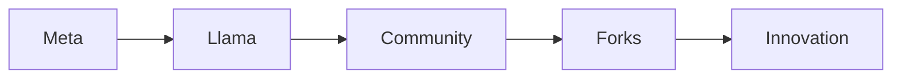

# Ejecutar un modelo de 125 mil millones de parámetros en una GPU de consumo: implicaciones para el poder, el beneficio y el futuro del código abierto

La reciente liberación de **Qwen 3.8 Flash Next (125B)** ha generado gran emoción en la comunidad de IA. Los resultados publicados en el repositorio Strata afirman que el modelo puede alcanzar aproximadamente **100 tokens por segundo (T/s)** cuando se ejecuta en una sola **RTX 4090**. Para un modelo de esta escala, esa velocidadCompite con muchos servicios de inferencia basados en la nube, y el hecho de que quepa en una tarjeta gráfica de gama de consumo indica un posible cambio en cómo se acceden a los modelos de lenguaje poderosos.

## ¿Logro técnico o simple estrategia de marketing?

Los números son impresionantes, pero también plantean preguntas sobre el método usado en la prueba. El proyecto Strata emplea un pipeline de inferencia altamente optimizado, aprovechando técnicas de cuantización, fusión de kernels y el algoritmo **FlashAttention‑2**. Estas optimizaciones reducen la presión de ancho de banda de memoria y mantienen la latencia baja, lo que permite procesar los 125 mil millones de parámetros a velocidades cercanas al tiempo real.

Desde el punto de vista del hardware, la RTX 4090 ofrece 24 GB de memoria GDDR6X, un ancho de banda de memoria de 1,5 TB/s y un número elevado de núcleos CUDA. Cuando se combina con un SSD NVMe rápido para los pesos del modelo, el sistema puede mantener la GPU abastecida de datos, evitando el temido "agotamiento de la GPU" que afecta a muchas implementaciones de modelos grandes.

Sin embargo, la afirmación de "100 T/s en una sola GPU" debe contextualizarse. Las tasas de throughput de tokens dependen fuertemente de la longitud del prompt, el tamaño del lote y la carga de trabajo específica (por ejemplo, generación versus embeddings). En la práctica, la mayoría de los usuarios verán velocidades más lentas al ejecutar lotes mayores o contextos más extensos. Aun así, el dato headline muestra que el hardware de consumo está cerrando la brecha con las GPUs de centros de datos de múltiples nodos.

## Las apuestas económicas de la concentración de poder

Si un modelo de 125 B puede ejecutarse localmente, sus repercusiones trascienden la novedad técnica. El ecosistema de IA está actualmente dominado por unas pocas corporaciones — **Meta, Google, Microsoft y Amazon** — que controlan tanto la investigación como la infraestructura subyacente (clústeres masivos de GPUs, ASICs propietarios y servicios de nube privados). Su capacidad para financiar investigación, adquirir datos y retener desarrolladores crea una **alta barrera de entrada** para actores independientes.

La aparición de un modelo desplegable de 125 B en una GPU de $1 500 desafía esta narrativa. Sugiere que la **IA descentralizada** podría convertirse en una alternativa viable, reduciendo la dependencia de las APIs en la nube y potencialmente remodelando la dinámica del mercado. No obstante, la realidad es más matizada.

1. **Concentración de capital persiste** – Aunque un usuario individual pueda alojar un modelo de 125 B, el **costo de adquisición** (la propia GPU, refrigeración, energía) sigue siendo sustancial. Las empresas que pueden amortizar estos costos entre enormes bases de usuarios seguirán dominando la economía del desarrollo de IA.
2. **Dependencias de cadena de suministro** – La RTX 4090 depende de la arquitectura de GPU propietaria de Nvidia. El **parado de mercado de Nvidia** en el stack de hardware de IA supera el 80 % para cargas de trabajo de aprendizaje profundo, lo que le otorga a Nvidia un amplio margen de maniobra sobre precios, soporte de drivers y ecosistemas de software.
3. **Código abierto frente a modelos propietarios** – Aunque proyectos como Qwen, Llama y Mistral liberan sus pesos bajo licencias permisivas, el **datos de entrenamiento**, **pipelines de optimización** y **herramientas de despliegue** a menudo permanecen propietarios. Esta asimetría significa que, aunque los pesos del modelo sean abiertos, la capa circundante sigue bajo control de unos pocos actores.

Históricamente, el panorama de IA ha oscilado entre **mainframes centralizados** y **computación distribuida en equipos personales**. En los años 70, los fabricantes de mainframes como IBM dictaban el acceso al poder computacional. El auge de los PCs en los 80 democratizó el desarrollo de software, desencadenando una explosión de innovación. Hoy, nos encontramos en un punto de inflexión: ¿la inferencia descentralizada seguirá la misma trayectoria de democratización, o se convertirá en otro nivel de **bloqueo de plataformas**?

## Relaciones de poder en la nueva economía de IA

La **distribución del poder** en IA no es solo técnica; es profundamente económica y política.

- **Control de datos** – Las grandes tecnológicas poseen vastas cantidades de datos propietarios usados para entrenar modelos. Incluso si un modelo puede ejecutarse localmente, el **corpus de entrenamiento** suele quedar como secreto corporativo. Esta asimetría alimenta un **ciclo de recursos**: datos → modelo → monetización.
- **Flujo de capital** – El capital de riesgo ha inyectado **cientos de miles de millones** en startups de IA, pero la inversión se concentra en empresas que pueden asegurar contratos de nube. Las **incentivos financieros** alinean sus intereses con mantener una arquitectura centralizada, pues garantiza ingresos recurrentes por servicios de cómputo.
- **Implicaciones regulatorias** – Los gobiernos están comenzando a examinar la **concentración de recursos de IA**. Investigaciones antimonopolio sobre el dominio de GPU de Nvidia y las prácticas de recopilación de datos de Meta insinuaron que **políticas públicas** podrían reconfigurar la distribución de hardware y modelos de IA.
- **Agencia comunitaria** – Las comunidades de código abierto pueden contrarrestar esta concentración al lanzar modelos que se ejecuten en hardware de bajo costo. Sin embargo, su influencia está limitada por los **efectos de red**: los usuarios tienden a preferir los modelos más precisos y bien soportados, que suelen estar respaldados por grandes presupuestos.

## Conectando pasado y presente

La tensión entre **control centralizado** y **acceso descentralizado** no es nueva. En los años 90, los primeros web se promocionaron como una fuerza democratizadora, pero pronto cayeron bajo el dominio de pocos portales (Yahoo, AOL, Google). De manera similar, el surgimiento de la **computación en la nube** prometió recursos bajo demanda, pero consolidó el poder en manos de unos pocos proveedores hiperescala (AWS, Azure, GCP).

La actual presión para ejecutar modelos masivos en GPUs de consumo refleja la promesa de la **informática personal**: tecnología que antes era exclusiva de instituciones se vuelve accesible a individuos. Sin embargo, cada ola de democratización ha sido seguida por una **re‑centralización** a medida que surgen nuevos modelos de negocio.

## El camino a seguir: oportunidades y riesgos

### Oportunidades

- **IA preservadora de la privacidad** – Ejecutar modelos localmente elimina la necesidad de transmitir datos sensibles a servidores externos, abordando crecientes preocupaciones sobre vigilancia y filtraciones de datos.
- **Eficiencia de costos** – Para aplicaciones específicas (p. ej., traducción en‑dispositivo, asistentes de codificación offline) la **economía de la inferencia** podría resultar mucho más barata que pagar tarifas por token a las APIs en la nube.
- **Diversidad de innovación** – Menores barreras de entrada podrían fomentar **nuevas aplicaciones** que las grandes corporaciones podrían considerar no rentables, enriqueciendo el panorama de IA con usos variados.

### Riesgos

- **Monopolio de hardware** – Si Nvidia continúa dominante el mercado de GPUs de alta gama, cualquier impulso hacia la inferencia local podría **reforzar su poder de mercado**, posiblemente llevando a aumentos de precios o licencias restrictivas.
- **Estándares fragmentados** – Una proliferación de modelos desplegados localmente podría generar **formatos incompatibles**, dificultan la interoperabilidad y la colaboración.
- **Huella energética** – Aunque una sola GPU puede ser más eficiente en consumo que un centro de datos, la inferencia personal a gran escala podría incrementar la demanda eléctrica, especialmente en regiones con redes carbon‑intensivas.

## Conclusión: Un momento para reflexionar

La capacidad de ejecutar **Qwen 3.8 Flash Next (125B)** a 100 T/s en una RTX 4090 es más que una curiosidad técnica; es una **señal** de que el panorama del hardware de IA está en transformación. Nos obliga a preguntar cómo se distribuirán **poder, capital e influencia** en la próxima década.

¿La inferencia descentralizada democratizará la IA, granting a individuals y pequeñas organizaciones una agencia real sobre modelos poderosos? ¿O se convertirá en otro canal para la **concentración de capital**, donde unos pocos proveedores de hardware y nube capturen la mayor parte del valor?

La respuesta dependerá de la interacción compleja entre **innovación técnica**, **fuerzas de mercado** y **decisiones políticas**. Como observadores independientes, debemos mantenernos vigilantes, apoyar ecosistemas abiertos y abogar por un acceso transparente y equitativo a las herramientas que moldean nuestro futuro digital.

---
