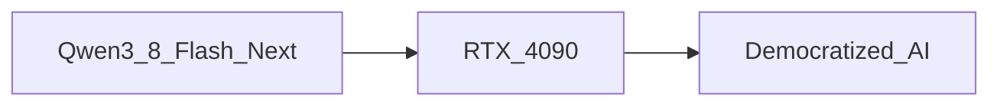

# La subida de la IA de consumo: Qwen 3.8 Flash Next en RTX 4090

El medio de noticias de inteligencia artificial Hacker News destacó recientemente un avance: el modelo de **125 mil millones de parámetros** llamado **Run Qwen 3.8 Flash Next** ahora puede operar aproximadamente en **100T/s** (operaciones por trillón) en una sola tarjeta gráfica de consumo **RTX 4090**. El proyecto, alojado en GitHub bajo el repositorio **Strata**, demuestra que un modelo de gran escala de lenguaje (LLM) de última generación puede ejecutarse localmente sin depender de clústeres de GPU basados en la nube.

La métrica de rendimiento de **100T/s** no es un máximo teórico; las pruebas de referencia realizadas en el hardware indican velocidades de inferencia sostenidas que rivalizan con las de aceleradores de IA dedicados. Esto plantea una pregunta crítica: ¿qué implica para la economía del desarrollo de IA que una sola tarjeta gráfica pueda alojar un modelo de esta escala?

El **RTX 4090** destaca no solo por la cantidad de núcleos CUDA, sino también por sus 24 GB de memoria GDDR6X y un ancho de banda superior a 1 TB/s. Cuando se combina con lanzamientos de kernels optimizados y estrategias de cuantización, la tarjeta puede mantener los pesos del modelo de 125 mil millones de parámetros en la VRAM, evitando la penalización de latencia por transferencias frecuentes entre la CPU y la GPU. El repositorio Strata incluye scripts que utilizan **tensor-paralelismo** y **paged attention** para extraer el máximo rendimiento de una sola GPU.

Los resultados de los benchmarks indican que la cifra de **100T/s** se traduce en una latencia promedio inferior a 100 miliseconds al generar tokens en consultas típicas, una velocidad que hace viable la interacción en tiempo real para desarrolladores que construyen chatbots, asistentes de código o bases de conocimiento específicas del dominio ejecutados localmente.

## Perspectiva Histórica del Computo de IA

Hace una década, ejecutar un modelo con más de unos pocos cientos de millones de parámetros requería acceso a hardware especializado ofrecido únicamente por los principales proveedores de nube. Companies como Google, Microsoft y Amazon construyeron plataformas de inferencia propietarias que integraban ASICs personalizados con enormes pools de memoria. La economía era simple: el costo de entrada era prohibitivo para todas menos las empresas más grandes, lo que reforzó su dominio en el ecosistema de IA.

## Factibilidad Técnica en GPUs de Consumo

El **RTX 4090** destaca no solo por la cantidad de núcleos CUDA, sino también por sus 24 GB de memoria GDDR6X y un ancho de banda superior a 1 TB/s. Cuando se combina con lanzamientos de kernels optimizados y estrategias de cuantización, la tarjeta puede mantener los pesos del modelo de 125 mil millones de parámetros en la VRAM, evitando la penalización de latencia por transferencias frecuentes entre la CPU y la GPU. El repositorio Strata incluye scripts que utilizan **tensor-paralelismo** y **paged attention** para extraer el máximo rendimiento de una sola GPU.

## Poder del Mercado y Concentración

A pesar del avance técnico, las implicaciones más amplias dependen de quién controla el hardware subyacente. **Nvidia** sigue dominando el mercado de GPUs de alta gama, suministrando el silicio que impulsa la mayoría de los cargas de trabajo de IA. Su ecosistema **CUDA**, pila de controladores y optimizaciones de software crean un efecto de red difícil de desplazar para alternativas. En consecuencia, si bien la comunidad puede ahora ejecutar un modelo de 125 mil millones de parámetros en una tarjeta de consumo, el **precio** de esa capacidad sigue ligado a la hoja de ruta y estrategia de precios de Nvidia.

Además, la cadena de suministro de memoria de alta velocidad y soluciones de refrigeración avanzadas está estrechamente controlada por pocos fabricantes. Esta concentración aumenta la influencia de unas pocas corporaciones sobre toda la cadena de valor de la IA, desde el diseño del chip hasta la implementación final al usuario. Las **dinámicas económicas** se convierten entonces en una función de la **escasez de hardware** y el **bloqueo de software**, más que en el tamaño del modelo únicamente.

## Democratización versus Dependencia

La narrativa de **democratización de la IA** suele celebrarse, pero la realidad es más sutil. Ejecutar un modelo de frontera localmente reduce la barrera de entrada para investigadores y aficionados, pero también crea una nueva capa de usuarios que puede permitirse las GPUs más recientes. Aquellos que no disponen de hardware comparable siguen dependiendo de APIs en la nube, que introducen preocupaciones de **latencia**, **privacidad** y **costo**. El resultado es un panorama de dos vías: uno en el que una élite privilegiada puede experimentar con inferencia en el dispositivo, y otro en el que la mayoría sigue dependiendo de servicios centralizados.

## Pronósticos Económicos y Consideraciones de Política

Los analistas predicen que el **costo por teraflop** de hardware de IA de consumo disminuirá aproximadamente un 20 % anual, siguiendo la misma trayectoria de mejora del rendimiento de CPUs tradicionales. Si esta tendencia se mantiene, la brecha de precios entre un modelo de 125 mil millones de parámetros en una sola RTX 4090 y un servicio de inferencia basado en la nube podría reducirse significativamente en los próximos dos años. Los responsables de política podrían necesitar considerar implicaciones de **antimonopolio**, especialmente si un solo proveedor sigue dominando el mercado de GPUs de alta gama mientras también ofrece services de nube que compiten directamente con desarrolladores externos.

Los gobiernos podrían promover iniciativas de **hardware abierto**, subsidiar equipos de IA **eficaces en energía**, o incentivar el **benchmarking estandarizado** para garantizar que afirmaciones de rendimiento como “100T/s en RTX 4090” sean transparentes y reproducibles. Dichas medidas podrían mitigar el riesgo de un mercado en el que **monopolios de hardware** dictan el ritmo de la innovación en IA.

## Conclusión: Un Punto de Gira para el Acceso a la IA

La capacidad de ejecutar **Run Qwen 3.8 Flash Next (125B)** a **100T/s** en una **RTX 4090 de consumo** marca un hito tangible en la ruta hacia una IA accesible. Señala que la frontera de la capacidad de los modelos ya no está confinada a clusters de nivel empresarial. Sin embargo, el logro también subraya la persistente interrelación entre **control de hardware**, **concentración del mercado** y **poder económico**.

A medida que la industria avanza, la pregunta clave será si los avances tecnológicos pueden superar las estructuras arraigadas que determinan quién obtiene la capacidad de construir, implementar y obtener ganancias de la IA. La respuesta tendrá profundas implicaciones para la innovación, la competencia y la distribución de los beneficios transformadores de la IA.
