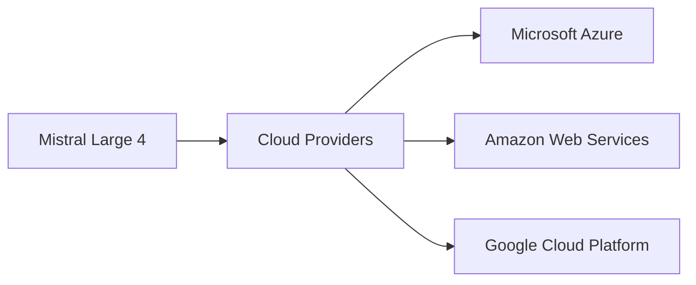

# Mistral Large 4: A Strategic Disruption in the AI Landscape

The release of **Mistral Large 4** by the French startup Mistral AI has sent ripples through the technology sector. While the model’s technical specifications—boasting multilingual fluency, advanced reasoning, and competitive performance against industry leaders—are impressive, the real story lies in how this launch reshapes existing power dynamics, capital concentration, and market strategies.

## The Launch in Context

Mistral AI announced the new model on its official blog, emphasizing a “large‑scale, open‑access” approach that mirrors earlier moves by Meta with Llama 2 and Anthropic with Claude. Unlike many closed‑source alternatives, Mistral Large 4 is offered under a permissive license, allowing commercial use and fine‑tuning. This decision deliberately targets enterprises that require customizable AI solutions without the overhead of vendor lock‑in.

## Market Power and Capital Concentration

The AI industry has become increasingly dominated by a handful of well‑funded players. Companies like **NVIDIA**, **Google**, and **Meta** have amassed billions in capital, enabling them to outspend startups on research, compute, and talent. This concentration creates a barrier to entry that often marginalizes smaller innovators. Mistral’s decision to release Large 4 under an open license challenges this status quo by democratizing access to state‑of‑the‑art capabilities.

However, the economic realities remain stark. Mistral’s recent funding round raised **€105 million**, a fraction of the multi‑billion investments of the megacorps. While this sum is sizable for a European startup, it pales against the cash reserves of the tech behemoths. Consequently, the **distribution of power** is still heavily tilted toward the incumbents, but the market dynamics are shifting as more participants demand open, interoperable models.

## Historical Parallels: From Open‑Source to Platform Wars

The current AI landscape echoes the early 2000s when open‑source tools like Linux began to disrupt proprietary operating systems. Back then, a handful of corporations—Microsoft, IBM, Sun—controlled vast computing resources, yet the open‑source movement forced a reevaluation of control points. Similarly, **Mozilla’s** early web standards sparked competition that reshaped the browser market, eventually leading to the rise of Google Chrome.

Mistral Large 4 follows a comparable trajectory: it leverages open‑source licensing to create a **platform‑agnostic** alternative, encouraging developers to avoid reliance on any single cloud provider. This move not only threatens the monopolistic tendencies of the major cloud platforms but also offers a **price‑competitive** avenue for enterprises seeking to reduce total cost of ownership.

## Strategic Alliances and Competitive Moves

Since its inception, Mistral AI has cultivated relationships with several key players. Notably, the company signed a partnership with **Microsoft** to make Large 4 accessible via Azure’s Model Hub, while also maintaining availability on AWS and GCP. This tri‑cloud stance signals a nuanced power play: Mistral leverages the infrastructure of the giants without becoming dependent on any one of them.

Such alliances underscore a broader trend where **strategic partnerships** become the new battleground for influence. By embedding its model in multiple cloud ecosystems, Mistral expands its reach while keeping the economic benefits distributed across several vendors. This approach may dilute the concentration of power that would otherwise arise if a single cloud provider were to host the model exclusively.

## Impact on Developers and Enterprises

For developers, the arrival of Mistral Large 4 translates into more choices and lower entry barriers. The model’s multilingual capabilities enable global teams to deploy applications in diverse markets without needing separate language‑specific models. Moreover, the permissive licensing empowers startups and research labs to experiment, iterate, and commercialize derived works without costly legal negotiations.

Enterprises, on the other hand, gain flexibility in negotiating contracts with cloud providers. Instead of being locked into a single vendor’s ecosystem, they can now evaluate **cost‑performance trade‑offs** across Azure, AWS, and GCP based on actual usage of Mistral Large 4. This shift fosters a more competitive pricing environment, potentially driving down the overall cost of AI services.

## The Road Ahead: Challenges and Opportunities

Despite its promise, Mistral Large 4 faces several hurdles. The model’s training required extensive compute resources, and sustaining that level of investment will require ongoing capital infusion. Additionally, the open‑source model can attract misuse, compelling Mistral to implement robust governance frameworks to mitigate potential harms.

Nevertheless, the broader opportunity lies in establishing a **more decentralized AI economy**. If a growing number of high‑quality, openly licensed models like Large 4 proliferate, the industry may move toward a **fragmented but resilient** architecture where power is diffused rather than concentrated. This would align with historical patterns where technological democratization precedes new waves of innovation.

## Conclusion: Reflecting on the Future of AI Power

Mistral Large 4 is more than a technical milestone; it is a catalyst for rethinking how AI technologies are developed, distributed, and monetized. As the model gains traction across cloud platforms, it forces the industry to confront entrenched structures of capital concentration and market dominance. Whether this development will lead to a truly open AI ecosystem or merely a reshuffling of existing power remains to be seen.

The key question for stakeholders—from investors to policymakers—is how to nurture an environment where innovation can thrive without being monopolized by a few deep‑pocketed corporations. The answer may lie in continued support for open‑access models like Mistral Large 4, coupled with policies that promote transparency and fair competition.

*What role will you play in shaping the next chapter of AI’s power dynamics?*