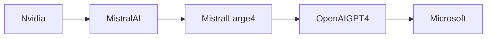

```mdx
# Mistral Large 4: ¿Un nuevo rival o la misma jugada de concentración de IA?

El anuncio reciente de **Mistral Large 4** en Hacker News ha despertado el entusiasmo de la comunidad de IA. Presentado como un modelo de lenguaje grande (LLM) de 13 billion de parámetros, abierto y optimizado para GPUs de Nvidia, Mistral promete competir con los gigantes de la industria: GPT‑4, Claude o Gemini. Pero más allá de los números de parámetros, la verdadera pregunta es qué revela este lanzamiento sobre la **estructura de poder** y la **concentración de capital** en la IA contemporánea.

## Un modelo “open‑source” bajo una sombra de inversión

Mistral AI, la startup francesa fundada en 2023 por ex‑investigadores de DeepMind y Meta, ha recibido rondas de financiación lideradas por **Lightspeed Venture Partners**, **Eurazeo** y **Sequoia Capital**. Aunque el proyecto se anuncia como “open‑source”, la versión completa del modelo solo está disponible bajo una licencia de uso restringido para empresas que paguen una suscripción. Este modelo híbrido —código abierto parcial con barreras comerciales— se ha convertido en la fórmula preferida de los actores con **capital de riesgo** que buscan minimizar riesgos mientras retienen la captura de valor.


## La eterna danza de poder entre gigantes del cloud y fabricantes de chips


El anuncio subraya la dependencia de Mistral a la arquitectura **Nvidia H100**. Este vínculo no es meramente técnico; es un pacto de poder. Nvidia controla el 95 % del mercado de GPUs para entrenamiento de IA, imponiendo precios que favorecen a empresas con presupuestos de cientos de millones de dólares. La decisión de Mistral de optimizar exclusivamente para H100 refuerza la **concentración de poder** en dos polos: los proveedores de cloud —principalmente **Microsoft Azure**, **Amazon Web Services** y **Google Cloud**— y los fabricantes de hardware, liderados por Nvidia.

Históricamente, la **lección del “AI winter”** de los años 80 y 90 muestra que la falta de infraestructura adecuada puede ralentizar el avance tecnológico. Hoy, la disponibilidad de GPUs de alta gama se ha convertido en la nueva infraestructura crítica, y su monopolio crea una barrera de entrada que favorece a los jugadores con los bolsillos más gruesos.

## Capital, talento y la “fuga” de Europa

Mistral se presenta como la **voz europea** en una escena dominada por EE. UU. Sin embargo, su dependencia de fondos estadounidenses y de alianzas con Nvidia muestra que la **soberanía tecnológica** sigue siendo una aspiración más que una realidad. El flujo de talento también evidencia esta asimetría: investigadores de élite continúan migrando a Silicon Valley o a los laboratorios de los gigantes del cloud, donde los salarios y los recursos de cómputo son mayores.

Esta dinámica es similar a la **concentración de capital en los 90**, cuando los conglomerados de telecomunicaciones absorbieron a la mayoría de los startups de Internet, estableciendo una jerarquía que todavía vigila la innovación. La diferencia radica en que la IA es ahora el nuevo “oro”, y la captura de sus modelos se traduce en **ventajas competitivas de mercado**: recomendación de productos, generación de contenido y, en última instancia, control de la información.

## Competencia real o ilusión de opciones?


En el anuncio, Mistral afirma que Large 4 supera a GPT‑3.5 en benchmarks de razonamiento y que su coste de inferencia es un 30 % menor. Si bien estos datos son prometedores, la **comparación directa** con GPT‑4, Claude 2 o Gemini es limitada porque esos modelos están entrenados con conjuntos de datos que incluyen **licencias comerciales y contenidos de terceros**, mientras que Mistral sostiene una política de datos “limpios” y de dominio público.

Esta diferencia genera una **asimetría de valor**: los modelos más poderosos (GPT‑4, Claude) están respaldados por **acuerdos de licencia que generan ingresos recurrentes** para sus creadores y para los proveedores de cloud que los alojan. Mistral, aunque más accesible, todavía necesita generar ingresos a través de **servicios premium**, creando un círculo donde el acceso gratuito alimenta la adopción, pero el modelo de negocio sigue girando alrededor de **pagos corporativos**.

## Tendencias históricas: del mainframe al cloud AI

Para entender la posición de Mistral, basta mirar la evolución de la industria:

| Época | Tecnólogo dominante | Modelo de negocio |
|-------|----------------------|--------------------|
| 1960‑70 | IBM mainframes | Venta de hardware, licencias de software propietario |
| 1990‑2000 | Microsoft/Intel | Licencias de software + venta de PCs |
| 2010‑2020 | Amazon/Google (cloud) | Pago por uso de infraestructura |
| 2020‑presente | Nvidia + OpenAI/DeepMind | Licencias de IA + acceso a GPU como servicio |

Cada fase muestra una **concentración creciente**: primero en hardware, luego en plataformas de cloud y, ahora, en los **modelos de IA** que controlan la generación de información. Mistral representa el intento de romper esa cadena, pero sigue anclado a los mismos eslabones de poder.

## ¿Qué significa para los desarrolladores y startups?

Para una startup europea que desea integrar un LLM, la aparición de Mistral Large 4 es una **ventaja de coste inicial**. No obstante, la dependencia de la infraestructura de Nvidia y de los servicios cloud de los grandes proveedores implica que la **factura operativa** a medio plazo puede escalar rápidamente. Además, la ausencia de un ecosistema de plugins y herramientas tan maduro como el de OpenAI (ChatGPT Plugin Store) deja a los desarrolladores con una curva de aprendizaje más pronunciada.

En términos de **propiedad intelectual**, el hecho de que Mistral mantenga una licencia restrictiva para usos comerciales limita la capacidad de construir modelos derivados, a diferencia de la filosofía de **Hugging Face**, cuyo modelo de negocio se basa en la comunidad y en la monetización de servicios alrededor de modelos libres.

## Perspectivas de regulación y políticas públicas

Los reguladores europeos están observando la **centralización de datos** y la **dependencia de IA** de proveedores estadounidenses. La propuesta de la Comisión Europea de un **AI Act** podría imponer requisitos de transparencia y de control de riesgos que afecten tanto a OpenAI como a Mistral. Sin embargo, la legislación tiende a tardar, mientras que la **carrera por la supremacía de IA** se acelera.

Una política pública que fomente la **investigación abierta**, la creación de **infraestructura nacional de GPU** y el **apoyo a startups locales** sería crucial para romper la actual **concentración de capital**. En lugar de financiar únicamente a unicornios respaldados por VC, los gobiernos podrían crear **fondos soberanos de IA** que mantengan la propiedad del modelo en manos públicas.




## Conclusión: ¿Un paso adelante o una vuelta al mismo círculo?

Mistral Large 4 demuestra que la **innovación en IA** sigue floreciendo fuera del cuartel general de Silicon Valley. Sin embargo, su modelo de negocio, su dependencia tecnológica y su financiamiento revelan que la **concentración de poder** sigue siendo la regla, no la excepción. La promesa de “open‑source” se diluye cuando el acceso comercial se vuelve la única vía de sostenibilidad financiera.

El verdadero desafío para la industria será decidir si la proliferación de modelos como Mistral desencadenará una **diversificación real** del ecosistema o simplemente añadirá otra capa a la **pirámide de capital** que ya domina la IA. La respuesta dependerá de decisiones de inversión, de políticas públicas y de la capacidad de los desarrolladores para navegar un entorno donde el poder está cada vez más centralizado en unos pocos proveedores de hardware y cloud.

> **Invitación a la reflexión:** ¿Podemos imaginar una arquitectura de IA donde el control del modelo y la infraestructura esté verdaderamente distribuido, o estamos condenados a replicar el mismo patrón de concentración que ha marcado la historia tecnológica?

```


graph LR
```