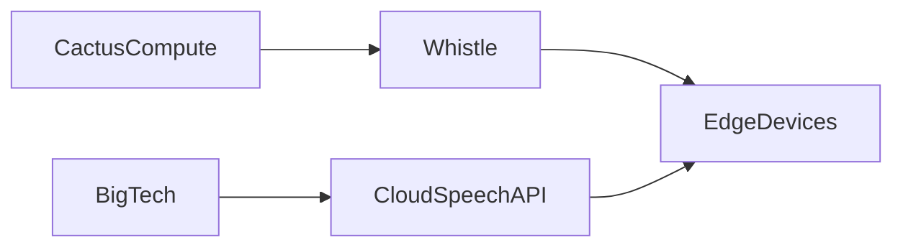

## Un modelo diminuto que pone en jaque a los colosos de la IA  

En el último post de **Cactus Compute**, la comunidad de Hacker News ha dirigido la mirada a *Whistle*, un motor de **speech‑to‑text** que ocupa apenas **16.9 MB**. A primera vista parece una curiosidad técnica, pero su aparición tiene implicaciones económicas y de poder que van más allá del mero tamaño del binario. En un mercado donde **Google**, **Microsoft** y **Amazon** capturan más del 70 % de los ingresos por servicios de reconocimiento de voz en la nube, la capacidad de ejecutar transcripciones localmente, sin necesidad de conectarse a un API de gran escala, abre una puerta a la **descentralización** y a la **reducción de la dependencia de capital**.

### ¿Por qué el tamaño importa?  

Los servicios de *speech‑to‑text* de los grandes proveedores se basan en modelos de cientos de millones de parámetros, entrenados con petabytes de datos y alojados en infraestructuras de **cloud computing** que cuestan millones de dólares anuales en GPU‑hours. El resultado es una **barrera de entrada** para startups y desarrolladores independientes que no pueden amortizar esos costos.  

Whistle, por el contrario, está construido bajo la premisa de *efficiency‑first*: un modelo de **transformer** reducido, cuantizado y optimizado para **CPU** y **ARM**, capaz de operar en dispositivos con recursos limitados (smartphones, Raspberry Pi, micro‑controladores). Esto no solo baja los costos de hardware, sino que también elimina la necesidad de enviar datos de audio a servidores externos, algo crítico para **privacidad** y **cumplimiento regulatorio** (GDPR, HIPAA).

### Concentración de capital y control de datos  

El dominio actual de la industria está estrechamente ligado al **control de datos**. Google, con *Speech‑to‑Text* y *Assistant*, recopila volúmenes masivos de grabaciones de voz que alimentan sus algoritmos de aprendizaje. Microsoft y Amazon hacen lo mismo con *Azure Speech* y *Amazon Transcribe*. Este **ciclo de recolección‑entrenamiento‑monopolio** refuerza su posición de poder y dificulta que actores externos compitan en igualdad de condiciones.  

Whistle rompe, al menos parcialmente, ese círculo. Al permitir el procesamiento local, el modelo reduce la necesidad de subir datos a la nube, limitando la capacidad de los gigantes de seguir acumulando voces sin el consentimiento explícito del usuario. Esta tendencia se alinea con el creciente movimiento **privacy‑by‑design** y con las presiones regulatorias que obligan a las empresas a ofrecer soluciones **on‑device** (Apple lo hace con *Siri* y *Voice Control*, pero mantiene el control del ecosistema).

### Dinámicas económicas reales  

Desde la década de los 90, la industria tecnológica ha evolucionado de **mainframes centralizados** a **computación en la nube**, y ahora a **edge computing**. Cada transición ha sido acompañada por una reconfiguración del flujo de capital:

| Era | Modelo de negocio | Concentración de capital |
|-----|-------------------|--------------------------|
| Mainframe (80s) | Licenciamiento de hardware | Alta (IBM, DEC) |
| PC (90s) | Venta de equipos + software | Moderada (Microsoft, Intel) |
| Cloud (2000‑) | SaaS + IaaS | Muy alta (FAANG) |
| Edge (2020‑) | Licencias de modelos ligeros + hardware barato | En transición |

Whistle se sitúa en la fase emergente del **edge**, donde los recursos de cálculo se desplazan al dispositivo. Esto genera oportunidades económicas para **fabricantes de hardware de bajo costo**, **OEMs** y **desarrolladores de aplicaciones locales** que ya no necesitan suscribirse a servicios de transcripción por minuto. Al mismo tiempo, crea presión sobre los proveedores de nube para ofrecer versiones **“lite”** de sus APIs o abrir sus modelos bajo licencias más permisivas.

### Empresas y estructuras de poder involucradas  

| Empresa | Rol en el mercado de speech‑to‑text | Estrategia reciente |
|--------|-------------------------------------|----------------------|
| **Google** | Lidera con *Speech‑to‑Text* y *Assistant* | Inversión en **LaMDA**, integración en Workspace |
| **Microsoft** | Azure Speech, integración con Teams | **OpenAI** partnership, desarrollo de *Whisper* |
| **Amazon** | Amazon Transcribe, Alexa Voice Service | Expansión a *AWS Panorama* (visión + audio) |
| **Apple** | *Siri* on‑device, Private Relay | Enfoque en privacidad, hardware cerrado |
| **Cactus Compute** | Creadores de *Whistle* (open‑source) | Modelo de comunidad, monetización a través de soporte y hardware integrado |

El caso de **Whisper**, el modelo de reconocimiento de voz de *OpenAI* lanzado en 2022, muestra cómo incluso un proyecto abierto puede ser absorbido por una empresa con recursos ilimitados. *Whisper* es eficaz pero, como sus contrapartes comerciales, sigue requiriendo GPUs potentes y, por ende, depende de la infraestructura de la nube. *Whistle* reconoce esa limitación y propone una alternativa orientada al **bajo consumo energético** y al **costo de operación**.

### Conexión con tendencias históricas  

Históricamente, cada disrupción tecnológica ha surgido como una respuesta a la **exclusión** de los mercados dominados por pocos jugadores. En los 80, la proliferación de el **IBM PC compatibles** desaceleró el monopolio de IBM. En los 2000, la **open‑source** (Linux, Apache) redujo la dependencia de licencias propietarias. Hoy, el **software compacto y distribuible** (como Whistle) actúa como el nuevo agente de equilibrio, democratizando una capacidad que antes requería infraestructura corporativa.

El patrón es claro: **la eficiencia tecnológica favorece la diversificación del poder**. Cuando los requisitos de hardware y de capital disminuyen, más actores pueden participar, lo que a su vez fomenta la innovación y presiona a los monopolios a abrir sus ecosistemas.

### Riesgos y limitaciones  

Otra dimensión es la **soberanía tecnológica**: los gobiernos que buscan reducir la dependencia de proveedores extranjeros podrían incentivar proyectos como Whistle, pero también podrían usar la narrativa de “seguridad nacional” para imponer regulaciones que favorezcan a corporaciones locales, reproduciendo así otra forma de concentración.

### El futuro del speech‑to‑text en el borde  

Si Whistle logra escalar su precisión y ser adoptado por una comunidad vibrante, podríamos observar:

1. **Mayor adopción de dispositivos offline** en sectores críticos (salud, finanzas, defensa).  
2. **Reducción de la facturación de cloud speech APIs** en más del 10 % a nivel global en los próximos cinco años.  
3. **Nuevos modelos de negocio** basados en hardware “inteligente” con IA integrada, donde el margen de ganancia proviene de la venta de dispositivos y no de suscripciones.  

Todo ello, sin duda, generará una reconfiguración del **ecosistema de inversión** en IA, con capital fluyendo hacia startups que ofrezcan soluciones ligeras y **open‑source**, mientras los gigantes buscarán proteger sus cuotas mediante **bundles** y **ecosistemas propietarios**.

## Conclusión  

Invito a los lectores a reflexionar sobre el papel que cada uno juega en este proceso: ¿preferimos la comodidad de los servicios en la nube bajo una sola empresa, o la independencia y la privacidad que ofrecen los modelos ligeros como Whistle?  

---

