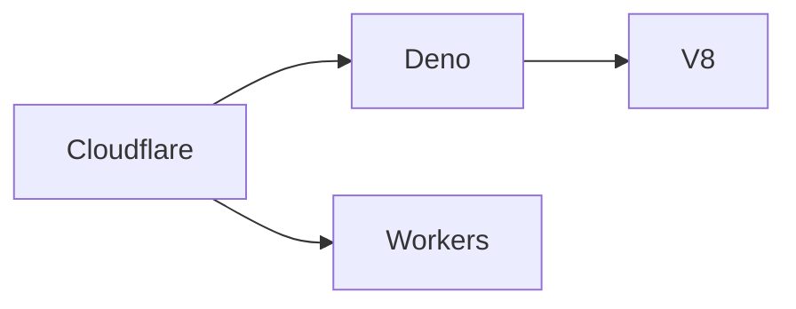

```mdx
## Introducción

A principios de octubre, **Cloudflare anunció la adquisición de Deno**, el runtime de JavaScript y TypeScript creado por Ryan Dahl, el mismo creador de Node.js. La noticia, que se propagó rápidamente en *Hacker News* y en el blog oficial de Deno, no solo representa un movimiento estratégico para la empresa de infraestructura de red, sino que también reabre el debate sobre la **concentración de poder** en la capa de ejecución de código en la nube. En este artículo reviso los antecedentes, analizo las motivaciones de Cloudflare y evalúo las implicaciones económicas y políticas para desarrolladores, competidores y el ecosistema de código abierto.

## Un breve repaso a Deno y a Cloudflare


### Deno, el “Node 2.0”

Lanzado en 2018, Deno se propone solucionar “las cicatrices” que Ryan Dahl reconoció en Node.js tras años de experiencia. Entre sus características destacan:

- **Seguridad por defecto** (sandboxed, permiso granular).  
- **Soporte nativo de TypeScript** sin necesidad de transpilers externos.  
- **Un único ejecutable** que incluye el motor V8, la librería estándar y el gestor de paquetes.  

Aunque nunca alcanzó la masa crítica de Node, Deno ganó una comunidad comprometida y se posicionó como una alternativa moderna para **edge runtimes**.

### Cloudflare, la superestructura de edge computing

Cloudflare, fundada en 2009, controla una de las **redes de entrega de contenido (CDN) más extensas del planeta**, con más de 200 centros de datos y una facturación que supera los $800 millones. Su producto *Cloudflare Workers* permite ejecutar JavaScript (y ahora también Rust y C) directamente en los bordes de la red, acercando la lógica a los usuarios finales.

## Motivos detrás de la adquisición

### Consolidación del stack de ejecución

Al integrar Deno, Cloudflare persigue una **unificación del runtime** para sus Workers. Actualmente, los Workers usan el motor V8 a través de **V8 isolates**, pero carecen de la ergonomía y la seguridad que Deno ofrece de forma nativa. Al combinar los dos mundos, Cloudflare puede lanzar una plataforma donde los desarrolladores desplieguen código TypeScript sin compilación previa, con permisos declarativos y una API de estándar de librería que reduce la fricción.

### Refuerzo de la barrera de entrada

Al poseer su propio runtime, Cloudflare disminuye su dependencia de **Node.js**, que está bajo la tutela de la *OpenJS Foundation* y, a la larga, influenciada por grandes corporaciones como Microsoft (a través de GitHub) y Amazon (con AWS Lambda). Este movimiento crea una **barrera de entrada** para competidores que quisieran ofrecer servicios de edge con un stack similar, pues tendrían que replicar una infraestructura ya “propietaria” y optimizada.

### Aprovechamiento de la comunidad open‑source

Deno se gestiona bajo una **licencia MIT** y mantiene un repositorio en GitHub muy activo. Cloudflare, al adquirirlo, gana acceso a ese talento, a los *contributors* y a la reputación de “framework amigable con desarrolladores”. La compra puede traducirse en una mayor retención de desarrolladores en el ecosistema de Cloudflare, lo que a su vez refuerza su **poder de mercado** en la capa de ejecución en la nube.

## Concentración de poder: un patrón recurrente


La historia reciente de la industria tecnológica está plagada de adquisiciones que consolidan el control de infraestructuras críticas:

| Año | Empresa compradora | Empresa objetivo | Área de impacto |
|-----|-------------------|------------------|-----------------|
| 2018 | Microsoft | GitHub | Código fuente y comunidad de desarrolladores |
| 2019 | Google | Looker | Analítica de datos y visualización |
| 2020 | Amazon | Zoox | Vehículos autónomos y logística |
| 2021 | Salesforce | Slack | Comunicación empresarial y productividad |
| 2022 | Adobe | Figma | Diseño colaborativo y prototipado UI |

En cada caso, la adquisición buscó **ampliar la “capa de influencia”** de la empresa compradora, permitiendo que sus plataformas se vuelvan más atractivas al integrarse con flujos de trabajo existentes. **Cloudflare → Deno** encaja perfectamente en esta línea: la empresa amplía su dominio desde la capa de red (CDN, DNS, WAF) hacia la capa de **runtime de aplicaciones**, cerrando el ciclo de entrega de servicios sin terceros.

## Dinámicas económicas reales

### Economías de escala y efecto de red

Al combinar la infraestructura de Cloudflare (más de 200 PoPs) con el runtime de Deno, la compañía puede ofrecer **costos marginales más bajos** a sus clientes. Un cliente que ya paga por el tráfico CDN puede ahora ejecutar lógica de negocio sin mover los datos a una nube tradicional, reduciendo latencia y facturación por ancho de banda. Esto crea un **efecto de red** donde más usuarios adoptan la plataforma, atrayendo aún más inversión y consolidando la posición de Cloudflare frente a rivales como **Fastly**, **Akamai** y los gigantes de la nube pública (AWS, Azure, GCP).

### Riesgo de monopolio de la capa de ejecución

Sin un contrapeso competitivo, la combinación de CDN y runtime puede traducirse en **precios de “lock‑in”** más altos. Los clientes que migren a Cloudflare Workers con Deno podrían encontrar costoso trasladar sus funciones a otro proveedor, ya que tendrían que reescribir código, adaptar permisos y abandonar la integración directa con la red. En términos de teoría de juegos, el **“estándar de facto”** impuesto por Cloudflare podría reducir la capacidad de negociación de los desarrolladores y de las startups que dependen de la plataforma.

## Impacto en la comunidad open‑source y los desarrolladores

### Beneficios potenciales

- **Mejora del runtime**: Con recursos financieros y de infraestructura de Cloudflare, Deno puede acelerar su hoja de ruta, lanzar compilaciones más rápidas y mejorar la documentación.  
- **Mayor visibilidad**: La marca Cloudflare atraerá a más desarrolladores hacia Deno, incrementando la adopción de TypeScript y de prácticas seguras por defecto.  
- **Integración nativa con Workers**: Los desarrolladores podrán desplegar funciones sin “build steps”, lo que reduce la complejidad del ciclo de vida de la aplicación.

### Riesgos y controversias

- **Reducción de la independencia**: Aunque Deno sigue bajo licencia MIT, la dirección del proyecto ahora está alineada con los intereses comerciales de Cloudflare. Decisiones de roadmap podrían priorizar casos de uso internos sobre propuestas de la comunidad.  
- **Posible “walled garden”**: La combinación de CDN y runtime puede incentivar a Cloudflare a ofrecer funcionalidades exclusivas que no estén disponibles en otros entornos, creando un ecosistema cerrado.  
- **Fusión de datos**: Con acceso a logs de red y de ejecución, Cloudflare podría recopilar datos de comportamiento de código, lo que plantea preguntas sobre **privacidad y gobernanza**.

## Comparación con tendencias históricas

En el **ciclo de los 2000**, la era de “platform as a service” (PaaS) vio a empresas como *Heroku* y *Red Hat* open‑sourcing sus herramientas para atraer a desarrolladores, antes de ser absorbidas por Salesforce y IBM respectivamente. El patrón se repite hoy: **open‑source como puerta de entrada**, seguido de **adquisición para controlar la infraestructura subyacente**.

La compra de Deno se sitúa en la confluencia de dos tendencias predominantes:

1. **Edge Computing** – Despliegue de código lo más cercano posible al usuario final.  
2. **Runtime Unification** – Reducción de la fragmentación entre Node, Deno, Bun y otras plataformas, favoreciendo a quien controle el “runtime universal”.

Cloudflare, al integrar Deno, intenta ser el **fabricante de la pila completa de edge**, una posición que sólo **Google** ha logrado parcialmente con su combinación de **Google Cloud Functions** y **Google Edge Cache**, pero que siempre ha dependido de **Android** como su sistema operativo dominante. Cloudflare aspira a replicar ese modelo, pero centrado en **JavaScript/TypeScript** y el **edge**.

## Perspectivas futuras

### Escenarios posibles

- **Escenario optimista**: Deno mantiene su independencia de proyecto, mejora su rendimiento y se convierte en el runtime de referencia para Workers, impulsando la adopción de código seguro y el crecimiento del mercado de edge services.  
- **Escenario prudente**: Cloudflare prioriza su negocio y reduce la visibilidad de la comunidad, limitando la innovación externa y provocando que otros proyectos (Bun, “deno‑forks”) ganen tracción como alternativas libres.  
- **Escenario alarmista**: El control de Cloudflare sobre la distribución de código en la red se traduce en prácticas de precios agresivas y limitaciones de exportación de datos, generando una reacción regulatoria similar a la que ha sufrido la Unión Europea con grandes plataformas digitales.

### Señales a observar

- **Política de código abierto post‑adquisición**: ¿Se mantiene la apertura del repositorio?  
- **Precios de Workers**: ¿Hay cambios en la estructura de costos para funciones con Deno?  
- **Reacción de competidores**: ¿Fastly o Akamai lanzarán sus propios runtimes “competitivos”?




## Conclusión

La adquisición de Deno por Cloudflare es más que una simple compra de tecnología; es una movida estratégica que refuerza la **concentración de poder** en la capa de ejecución de aplicaciones en la nube. Si bien los desarrolladores pueden beneficiarse de un runtime más seguro y de una integración más fluida con la red, también se plantea una pregunta central: **¿estamos construyendo un ecosistema más abierto o una nueva fortaleza tecnológica que limitará la competencia?** La respuesta dependerá de la manera en que Cloudflare equilibre sus intereses comerciales con la tradición de código abierto que ha definido a Deno desde sus inicios. Como comunidad, debemos observar atentamente, participar activamente y, sobre todo, mantener viva la discusión sobre qué tipo de internet queremos construir.

---