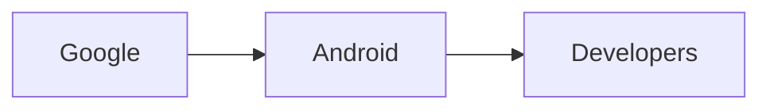

## Un Calma Inquietante

## Un Patrón Repetido

Para entender este fenómeno, debemos mirar hacia atrás el patrón que se ha repetido cada vez que un modelo de IA disruptivo entró al mercado. A principios de la década de 2010, los avances en deep learning de Google Brain y Facebook AI desataron una frenesí de startups y adquisiciones. La llegada de GPT‑3 en 2020 desencadenó una ola de hype que vio a los proveedores de nube competir por ofrecer granjas de GPU exclusivas, mientras los inversores vertían miles de millones en fondos centrados en IA. Cada ola estuvo acompañada de titulares sobre «el fin del software tradicional» y guerras de talento frenéticas.

## Estructuras de Poder en el Panorama Actual

Hoy, el panorama está dominado por un pequeño número de gigantes verticalmente integrados: Google con su suite Gemini, Meta con sus derivados de LLaMA, Amazon con Bedrock y Microsoft con Azure AI. Estas empresas controlan no solo los recursos de cómputo, sino también los canales de distribución, los contratos de nube y las fases de ventas a empresas. Sus estrategias se están coordinando cada vez más a través de consortios de investigación conjuntos, acuerdos de licenciamiento cruzado y grupos de talento compartidos. En este entorno, un nuevo arrivante como DeepSeek, incluso si es técnicamente superior en algunos indicadores, amenaza el delicado equilibrio de cuota de mercado y percepción regulatoria.

## Concentración de Capital y Financiamiento Estatal

La concentración de capital en el sector de la IA ha alcanzado un punto en el que unos pocos fondos de riqueza soberana y megafondos pueden dictar el ritmo de lanzamientos de modelos. El gobierno chino, a través de su iniciativa «Made in China 2025» en IA, ha canalizado financiación vinculada al Estado a empresas como DeepSeek, permitiéndoles escalar sin la presión inmediata de los plazos de salida del capital de riesgo. Este respaldo financiero crea una barrera que protege a la empresa de la escrutinio del mercado a corto plazo, permitiéndole centrarse en la refinación técnica más que en el marketing agresivo.

## Incentivos Económicos para los Incumbentes

Desde el punto de vista económico, las plataformas incumbentes han construido modelos de ingresos enteros alrededor del acceso basado en suscripciones a sus APIs, créditos de nube y hardware especializado. Si un modelo de bajo costo y alto rendimiento socava estas fuentes, la respuesta racional es minimizar su impacto, redirigir la inversión a mejoras incrementales o adquirir la amenaza. La reacción apagada a DeepSeek 4.1 Flash puede leerse como un acto deliberado de restricción: evitar señalar vulnerabilidad mientras se espera para ver si el modelo puede integrarse en las líneas de producto existentes sin cannibalizar ventas actuales.

## Paralelos Históricos y Respuestas del Mercado

Este patrón se parece a momentos anteriores en los que protocolos de código abierto interrumpieron pilas propietarias. El auge de Linux en los años 90 fue inicialmente desestimado por los proveedores de Unix, sólo para convertirse en la base de la infraestructura cloud moderna. De manera similar, los primeros días de la cadena de bloques vieron a los bancos ignorar la tecnología hasta que fue demasiado tarde para alcanzarla. En cada caso, el miedo de la industria estaba temperado por una evaluación calculada de cuánta disrupción podía absorberse antes de que el modelo de negocio colapsara.

## Adquisiciones Corporativas y Control Narrativo

Tomemos, por ejemplo, la reciente adquisición de Adept por un gran proveedor de software empresarial, que se enmarcó como una «adquisición de talento» más que como una medida estratégica contra startups emergentes de IA. De la misma manera, la compra de DeepMind por Google se presentó como una inversión en investigación, pero internamente señalaba el deseo de controlar la próxima generación de sistemas autónomos. Estas narrativas se crean deliberadamente para mantener la confianza de los inversores mientras se difiere la presión competitiva.

## La Perspectiva del Desarrollador

Los desarrolladores, que son los árbitros definitivos de la adopción de modelos, a menudo carecen de visibilidad sobre los movimientos financieros tras bastidores. Notan mejoras en el rendimiento, diferencias de precios y entusiasmo comunitario, pero rara vez reciben información transparente sobre las estructuras de capital que hacen posible esos logros. Como resultado, muchos continúan construyendo sobre plataformas establecidas, reforzando el fortalecimiento de la incumbencia y dificultando que proyectos disruptivos alcancen masa crítica.

## Mirando Hacia el Futuro: Regulación, Alianzas y Consolidación

El futuro de DeepSeek 4.1 Flash probablemente estará marcado por tres fuerzas entrecruzadas: la supervisión regulatoria, las alianzas estratégicas y el bloqueo de ecosistemas. En el frente regulatorio, gobiernos en EE. UU., la Unión Europea y China están redactando marcos de gobernanza de IA que podrían imponer requisitos de transparencia sobre los datos de entrenamiento, el origen del cómputo y la seguridad de despliegue. Si DeepSeek navega con éxito estas normas, podría obtener una ventaja de primer movimiento en mercados que prioricen el cumplimiento sobre el rendimiento puro. Estratégicamente, la empresa ya ha asegurado acuerdos de investigación conjunta con varios laboratorios universitarios en Beijing, lo que le brinda acceso a clusters de hardware de última generación financiado por programas científicos nacionales. Estas colaboraciones no solo aceleran la iteración del modelo, sino que también integran la tecnología de DeepSeek en pipelines académicos, fomentando una nueva generación de ingenieros que podrían migrar a roles industriales que favorezcan la pila de la startup.

## La Amenaza de Fusiones Defensivas

Por último, la posibilidad de una adquisición de alto perfil no puede ignorarse. Históricamente, las grandes empresas tecnológicas han usado adquisiciones para neutralizar amenazas disruptivas mientras preservan talento y propiedad intelectual. Si la tracción de DeepSeek continúa, es plausible que un consorcio de inversores — quizá una combinación de fondos soberanos y fondos de private equity — orqueste una fusión defensiva con un proveedor de nube de tamaño medio, consolidando así los recursos de cómputo y reduciendo la exposición a guerras de precios. Este movimiento no solo protegería la cuota de mercado, sino que también señalaría a los reguladores que la industria es capaz de autocontrolarse, potencialmente pre‑emptando medidas legislativas más estrictas.

## Reflexión

