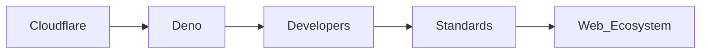

# Cloudflare's Deno Acquisition: Capital Consolidation in the JavaScript Ecosystem

On a typical Thursday in early 2025, a brief announcement on deno.com/blog/cloudflare sent ripples through the JavaScript community. Cloudflare, the US-based web infrastructure and cloud services giant, confirmed its acquisition of Deno, the secure runtime for JavaScript and TypeScript created by Ryan Dahl and maintained by a small but influential core team. The news, first amplified on HackerNews, reopened a dialogue as old as the industry itself: when does open-source infrastructure become infrastructural capital, and who decides the terms of its custody?

## The Announcement and Immediate Reactions

The blog post framed the transaction as a "natural progression" toward integrating Deno's standards-based APIs into Cloudflare's edge network. For developers accustomed to Deno's promise of browser-compatible TypeScript execution, zero-installed tooling, and a curated standard library, the prospect of corporate ownership raised immediate questions. On HackerNews, comments ranged from cautious optimism about improved tooling integration to skepticism about the long-term viability of a project now answering to a boardroom focused on quarterly metrics.

But the reaction also reflected a deeper, more structural concern. Deno occupies a delicate position in the JavaScript ecosystem: it is neither the dominant Node.js runtime nor a niche academic experiment. It is a consciously standards-aligned alternative, positioning itself as what its creators term "JavaScript as it ought to be"—with built-in TypeScript support, secure-by-default permissions, and a deployment model that mirrors modern cloud expectations. Cloudflare, for its part, has spent the better part of a decade building an edge computing platform that competes directly with AWS Lambda@Edge, Fastly, and Akamai. Its Workers runtime is already a major force, supporting JavaScript and TypeScript out of the box. Acquiring Deno could be read as an attempt to own not just the execution environment, but the standards that govern it.

## Power Dynamics in the JavaScript Runtime Layer

To understand the acquisition's significance, one must look beyond the code and examine the distribution of power. Cloudflare is a publicly traded company with over $1 billion in annual revenue, a market capitalization hovering in the $20 billion range, and a customer base that spans from Fortune 500 enterprises to independent developers building on its Workers platform. Deno, by contrast, operates as Deno Land Inc., a privately held entity that has raised modest venture funding but remains fundamentally dependent on community contributions, GitHub sponsorships, and the intellectual labor of its core maintainers.

## Capital Concentration and the Open Source Ecosystem

However, this efficiency comes at a cost that extends beyond balance sheets. The concentration of runtime infrastructure in fewer hands means that the economic value generated by the JavaScript ecosystem funnels through a smaller set of gatekeepers. When Cloudflare decides which standards to prioritize, which deprecations to announce, and which features to ship, the ripple effects touch every developer who depends on those primitives. For startups and small teams, the acquisition could simplify deployment workflows—Deno on Cloudflare Workers means fewer configuration hurdles. But it also introduces a dependency risk: if Cloudflare alters Deno's licensing terms, adjusts its free tier, or pivots its roadmap to serve enterprise customers exclusively, the ecosystem's most vulnerable actors bear the brunt.

## Historical Precedents and Industry Trajectories

The JavaScript runtime wars follow a parallel, if faster, trajectory. Node.js's dominance was not an accident of technical superiority alone but of timing, npm's infrastructure, and early corporate backing from Joyent and later Microsoft's GitHub acquisition. Deno emerged as a corrective vision, addressing Node's callback hell, legacy module system, and security model gaps. Its growth, while modest compared to Node's installed base, carved a niche among developers prioritizing type safety, browser compatibility, and a std library that doesn't feel like an afterthought.

Cloudflare's acquisition of Deno can be read as an attempt to co-opt that niche, to integrate a standards-forward runtime into a platform that already commands a significant share of web traffic. But the historical record suggests that such integrations often come with a re-alignment of priorities. The question is not whether Cloudflare will technical integrate Deno—its engineers are more than capable—but whether the project's identity as an open, standards-aligned alternative will survive the corporate wrangling that inevitably follows capital inflow.

## Economic Realities for Developers and Enterprises

From a developer's perspective, the immediate practicalities are tempting. Deno's deployment story—`deno deploy` for global edges, local-first development, built-in tooling—maps neatly onto Cloudflare Workers' `wrangler` workflow. For teams building TypeScript-heavy applications, the prospect of a unified runtime across local, edge, and cloud environments reduces context-switching and potential for configuration drift. Enterprises, too, may welcome the bundled security model and standards compliance as a check against the fragmentation that often plagues Node.js deployments.

For large enterprises, the appeal lies in predictable roadmaps, SLA-backed support, and the ability to influence feature priorities through established corporate channels. But this comfort comes at the price of reduced transparency. When Deno's roadmap is set against Cloudflare's quarterly earnings calls, the public rationale may diverge from the underlying market calculus. Developers who value open governance may need to weigh the convenience of integrated tools against the long-term sustainability of a project now answerable to shareholders.

## Toward a Critical Reading of the Acquisition

## Looking Ahead: Monitoring the Shifts

In the months following the announcement, three developments will merit close attention. First, how Cloudflare integrates Deno's API surface into its Workers runtime without eroding the standards-compatible ethos that made Deno attractive. Second, whether Deno's governance structure is expanded, maintained, or effectively dissolved into Cloudflare's existing decision-making apparatus. Third, how the broader ecosystem—package managers, frameworks, CI/CD tools—adapts to the possibility of a de facto Cloudflare-backed default for TypeScript/JS execution at the edge.

These are not questions with obvious answers, and their resolution will likely unfold over years rather than quarters. What is clear is that the balance of power in the JavaScript runtime layer has shifted, and with it, the economic and political calculations of everyone who depends on it.

## Conclusion: Sovereignty in an Increasingly Concentrated Stack

For developers, the takeaway is neither panic nor blind enthusiasm. It is a recommitment to understanding the layers beneath the abstractions we use daily. It is a reminder that "free" tools often carry implicit dependencies on the celles that fund them, and that maintaining genuine sovereignty—whether through forking, contributing to governance bodies, or supporting alternative stewards—requires deliberate action. The Deno Cloudflare chapter is writing itself as we speak, and its pages will be read by every developer who chooses whether to trust, fork, or build upon what was once an independent vision.